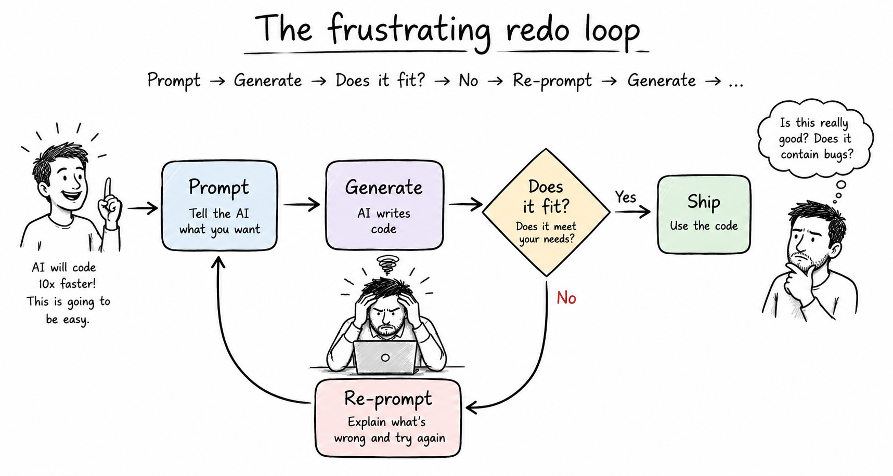
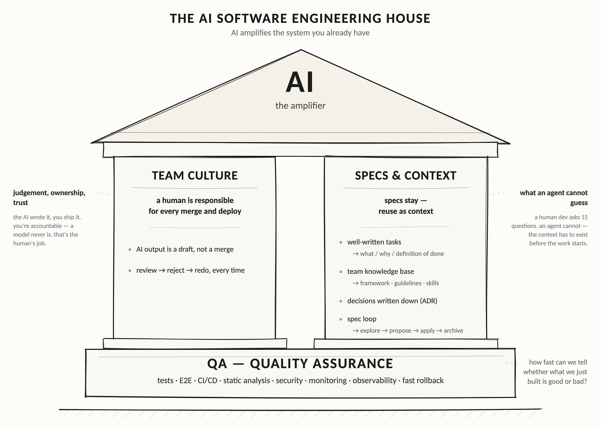
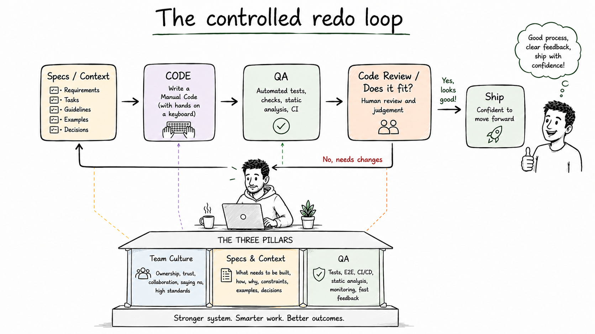
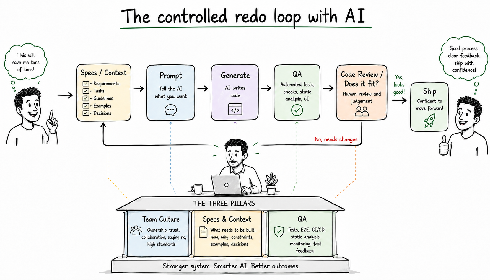
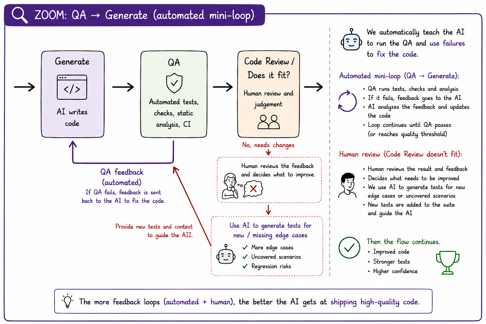
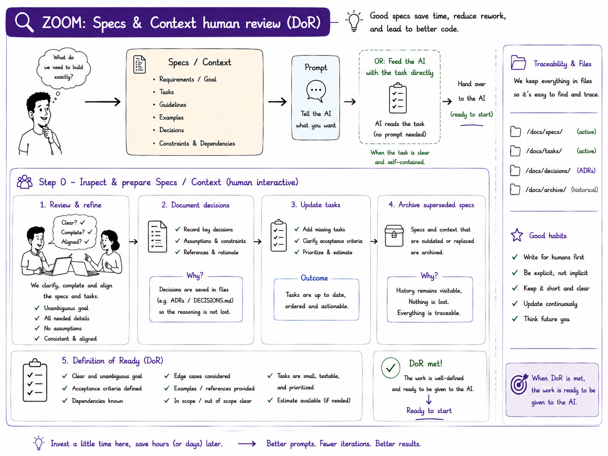
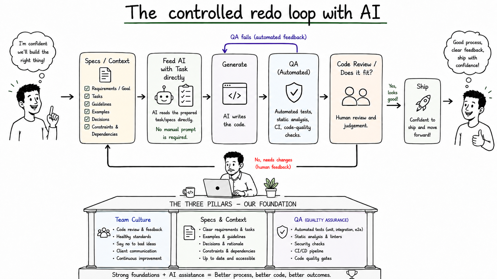

How many times have you been told to use AI to boost your productivity? It writes code 10× faster. You just need to give it a prompt and let it work.

## The frustrating redo loop

Reality looks like this:

**Prompt → Generate → Does it fit? → No → Re-prompt → Generate → Does it fit? → No → Re-prompt…**

The problem is not necessarily the quality of the model. The problem is the _system around it_ — the **harness** — that doesn’t give the agent (the AI running your tools in a loop) enough context or feedback to know whether what it produced is actually right.

Two things make it worse: the same prompt can return five different answers (it's non-deterministic), and the model will confidently invent APIs that don't exist.

---

AI does not fix a development system, it amplifies the one you already have. So the interesting work isn't the AI — it's having solid software-development pillars: QA, Team Culture and Specs & Context.

> Based on Andreas Wolf’s T3DD26 talk _“Before You Let AI Touch Your Code”_ ([slides](https://a-w.io/talks-public/events/2026-t3dd/ai-harness/))

I’d been circling this idea for weeks without a way to draw it. Then, during Andreas Wolf’s talk, it clicked — he’d already framed what I was trying to say. The house is my take on it. Same idea as the harness: everything around the AI that makes its output trustworthy — the house is just the harness drawn.

These pillars are not AI-specific infrastructure. They are good engineering practices even when no AI is involved: clear specifications help humans, QA gives humans fast feedback, and team culture creates ownership and trust.

---

## The short version (TL;DR)

1. **AI is an amplifier, not a fix.** DORA’s 2025 report (~5,000 professionals) concludes that AI magnifies existing strengths _and_ existing dysfunctions. Strong teams get faster; weak teams get faster at producing mess. ([DORA 2025](https://dora.dev/dora-report-2025/))
2. **Throughput up, stability down.** The same report finds AI adoption correlates positively with delivery throughput and product performance — and _negatively_ with delivery stability. More change volume without control systems = instability. ([Google Cloud](https://cloud.google.com/blog/products/ai-machine-learning/announcing-the-2025-dora-report))
3. **The bottleneck moved.** Writing code is no longer the expensive part. Understanding what to build, specifying it, verifying it, and deciding to release it are. The value of requirements, architecture, review and judgement goes _up_, not down.
4. **Perceived speed ≠ real speed.** In a randomised trial, 16 experienced open-source developers were **19% slower** with AI on their own repos — while believing they had been ~20% faster. ([METR](https://metr.org/blog/2025-07-10-early-2025-ai-experienced-os-dev-study/))
5. **Trust is falling while usage rises.** 84% of developers use or plan to use AI tools, but only 33% trust the output (down from 43%); 66% name “almost right, but not quite” as their main frustration. ([Stack Overflow 2025](https://survey.stackoverflow.co/2025/), ~49,000 respondents)
6. **A human is responsible for every merge and deploy.** A model cannot be held accountable — that is the human’s job. ([Osmani](https://addyosmani.com/blog/code-review-ai/))
7. **Practical order of work:** fix QA first (it is measurable and it pays twice), then the spec/context layer, then let AI amplify.

> _Before adopting AI, build the house that AI can live in._

Using the three pillars as foundation of our software development the AI can assist us in writing better code, code that respects specs and standards, that does what is supposed to be done, while the human is still responsible and observes the whole loop from a different angle.

---

## How to read this house — a common team approach

This is a shared way of working, not a one-off. Because AI only _amplifies_, **every project must stand on all three pillars.** Miss one and AI amplifies the gap.

The good news: most of the house is a shared team standard — you instantiate it per project, you do not rebuild it.

| Pillar | Shared asset we already have | Per project |
| --- | --- | --- |
| QA | shared CI pipelines, adopted across many projects | wire in the repo's own test suite |
| Specs & Context | code guidelines + Claude skills, our framework | tasks, specs, ADRs, domain knowledge |
| Team Culture | same review + ownership rules for the whole team | a human owning every merge |

**Why all three are non-negotiable — what AI does when a pillar is missing:**

| Missing | What AI does |
| --- | --- |
| QA | can't run any check on its own → optimises a fake target |
| Specs — tasks are just a title | can't tell what you meant → guesses and derives |
| Specs — no shared guidelines / skills | generates incoherent, off-standard code |
| Team Culture — no human supervision | merges broken code → ships bad things to production |

Remove any one → it collapses.

---

## The house, part by part

Each part predates AI. What changes is the stakes — AI works faster and more autonomously, so every part now has to hold under more pressure. Why each one matters _more_ with AI:

- **Roof — AI:** the amplifier. It multiplies whatever the other three give it — and nothing more.
- **Left wall — Team Culture:** judgement, ownership, trust. AI changes _how we decide_ and _who is accountable_, not just how fast we type.
- **Right wall — Specs & Context:** what an agent cannot guess. Unlike a colleague it cannot ask — so the intent has to exist in writing before the work starts.
- **Foundation — QA:** tests, E2E, CI/CD, static analysis, security, monitoring, fast rollback. The one signal that tells the agent — and you — whether what it just built is good or bad.

Remove one part and it collapses. Individually they underdeliver; connected, they give the multiplier.

---

## 1. Foundation: QA is the objective function

Do not read QA as “we test the code”. Read it as: **we have a system that tells us quickly whether what we produce is good or bad.**

With AI this becomes literal. The QA pipeline is the _objective function the agent optimises against_: tests + E2E + types + lint + CI = a machine-readable definition of “done” that the agent can verify itself, iterate against, and fail on. Without it, the agent optimises a fake target and you are left grading its homework by hand.

(This isn't "training" in the machine-learning sense — the model isn't learning from your CI. The pipeline is simply the pass/fail signal the agent loops on until it goes green.)

The harness was valuable before AI; AI just makes it _matter more_ — because now the tools can be run by the AI itself.

| | No AI | With AI |
| --- | --- | --- |
| **Harness** | green | green |
| **No harness** | red | **?** (unpredictable) |

In an AI/software context, "harness AI" has a nice implication — AI has power, but you need a system around it to direct that power effectively.

- DORA names **strong automated testing, mature version control and fast feedback loops** as the control systems that prevent rising change volume from turning into instability.
- It pays twice: the same tools serve humans and agents. One investment, two beneficiaries.
- It is measurable: test count up, static-analysis errors down. You can see it working.
- Guardrail against gaming: fail the build if the **static-analysis baseline grows**. Removing baseline entries because you fixed the code is fine; adding entries to hide new problems is not.

**Live example from the T3DD26 talk:** a Claude Code session ran PHPStan on its own, saw 4 errors, fixed the 2 it had introduced and left the 2 pre-existing ones — because it had the tool and a clear pass/fail signal.

## 2. Right pillar: Specs & Context

A human developer can ask 15 questions, read your face, and reconstruct what you meant. An agent cannot. **The context has to exist before the work starts.**

A 2–3 line prompt is a lossy compression of everything in your head plus the docs — and models are good at pattern completion, not mind reading. GitHub’s Spec Kit frames the same problem: a vague prompt forces the model to guess thousands of unstated requirements, so the spec becomes “the source of truth your tools and AI agents use to generate, test and validate code”. Its loop is `/specify → /plan → /tasks → /implement`; OpenSpec's is `explore → propose → apply → archive`, where the archive is _kept_ and referenced by later specs. ([GitHub Blog](https://github.blog/ai-and-ml/generative-ai/spec-driven-development-with-ai-get-started-with-a-new-open-source-toolkit/))

A developer is _immersed_ in the company, and soaks up a whole layer the agent never sees: coding conventions nobody wrote down, how this team names things, which corners of the codebase are fragile, who owns what, the decisions made long ago and the reasons behind them, the product's tone, the unwritten quality bar, the company's values and style. Much of a project's intent also travels by word of mouth — from the client to the project lead to the developer — carrying priorities, the _why_, and shades of vision and goals that never land in a ticket. A new hire absorbs all of this over months — through reviews, conversations, osmosis. An agent starts every session cold: it has none of it and can't pick it up by hanging around. The only way that knowledge enters its world is if someone makes it explicit — in guidelines, ADRs, examples and specs. That is the real job of this pillar: turning ambient, tacit team knowledge into context the agent can actually read.

What belongs in this pillar:

- **well-written tasks — what / why / definition of done** (the DoD is what the agent can check against QA; a task that is only a title forces the agent to guess)
- **team knowledge base — framework · guidelines · reusable skills** — our TYPO3 framework, code guidelines and shared Claude skills, folded into one: to an agent they are all reference material it loads, and they are what keep AI output coherent and on-standard. Keep guidelines a concise bullet list, not sprawling prose, or you clog the context window (the limited amount of text the model can consider at once). Includes technical documentation and domain knowledge & examples — the niche knowledge not in training data (TYPO3 best practices sit in private corporate repos).
- **decisions written down (ADRs — architecture decision records)** — read by both people _and_ agents as context ([Nexapp](https://www.nexapp.ca/en/blog/architecture-decision-records-adr), [Actual AI](https://www.actual.ai/blog/agent-optimized-adrs))
- **specs stay, reuse as context** — write once; every later prompt inherits the captured intent
- **the spec loop — explore → propose → apply → archive** — the lifecycle that keeps specs alive. Writing a spec is a point-in-time act; the loop is the operating model. The _archive_ step is the differentiator: a finished spec is not deleted but folded into the durable baseline that later specs (and later agents) read. This is what turns “specs stay, reuse as context” from a slogan into a mechanism. OpenSpec is the concrete tool for it (see Sources); we have not adopted it yet.

## 3. Left pillar: Team Culture

The most underestimated pillar, because AI does not only change how we write code. It changes how we decide what to build, how we distribute work, how we review, how much we trust each other’s output, how we admit we do not know something, how we handle AI mistakes — and who is responsible for the result.

- **AI output is a draft, not a merge.** Two failure modes: reject everything, or blind-merge everything. Blind-mergers look faster for weeks, then drown in slop — plausible-looking output that isn't actually right.
- **Review → reject → redo, every time.** No “it worked for 10 PRs, so #11 goes in blind.” Demand proof (tests, logs) over promises; keep batches small enough that a human can actually understand them. The OCaml maintainers rejecting a 13,000-line PR is the reference case. ([Osmani](https://addyosmani.com/blog/code-review-ai/))
- **A human owns every merge and deploy.** The AI wrote it, you ship it — you are accountable, a model never is. “A computer can never be held accountable — that’s your job as the human in the loop.”

Kept deliberately lean and dev-focused: the diagram drops softer culture lines (the right to say NO, “I don’t know” is allowed, how we adopt standards) — real, but attitude rather than harness, and “say NO” is already inside review → reject → redo.

The trust data makes this concrete: near-universal usage, roughly a third trusting the output, and “almost right but not quite” as the top complaint. Teams need a culture where _“I don’t trust this output, let’s verify it”_ is normal engineering, not resistance to AI.

## Sanity check on the hype

Take both directions of the evidence seriously:

- Self-reported productivity is high (80%+ report gains in DORA) but the one randomised trial we have found a 19% slowdown for experienced developers on familiar codebases, with a large perception gap. METR itself cautions against over-generalising (16 developers, 246 tasks, early-2025 tooling).
- Read together, the honest summary is: **AI reliably increases output volume; whether that becomes value depends on the system around it.** Which is exactly the house.

## What to do next

1. **Assess where you are** — grade yourself per part of the house; find the weak pillar.
2. **Fix the objective function first** — QA, in small modular steps. Not “boil the ocean”.
3. **Then build the context layer** — task template (what / why / DoD), a short guidelines file, ADRs, reusable skills.
4. **Then let AI amplify** — with a human owning every merge and deploy.

---

## Bonus track 1: Automated QA

You can teach the AI to run QA after each edit — or read the GitLab pipeline results — and, based on the outcome, fix the code, adapt, and add more tests.

---

## Bonus track 2: Specs and DoR sanity check

It’s a good habit to keep a Definition of Ready (DoR), and to keep specs and decisions in local Markdown files — that's what gives the AI the context it needs.

---

## Bonus track 3: feed AI with tasks not with prompt

Once your tasks meet a clear Definition of Ready — and your specs, context, and decisions are complete, controlled, and continuously updated — you can feed tasks directly to AI and escape the prompt-and-pray loop.

---

> “AI can make mistakes.”
>
> You bet.

But perhaps the disclaimer is still too cautious. Just remove “can”:

**AI makes mistakes.**

So do humans. The difference is that AI can produce them faster, at scale, and with remarkable confidence. That doesn’t make AI useless. It means we need to stop treating its output as a finished product.

Clear specifications, automated tests, code reviews, and human judgment aren’t optional extras around AI-assisted development. They’re what makes it work.

---

## Sources

- [DORA — State of AI-assisted Software Development 2025](https://dora.dev/dora-report-2025/) · [full PDF](https://services.google.com/fh/files/misc/2025_state_of_ai_assisted_software_development.pdf) — AI as amplifier; seven-capability model; throughput vs stability.
- [Google Cloud — Announcing the 2025 DORA report](https://cloud.google.com/blog/products/ai-machine-learning/announcing-the-2025-dora-report) — headline findings, ~30% little/no trust, safety-net argument.
- [METR — Measuring the Impact of Early-2025 AI on Experienced Open-Source Developer Productivity](https://metr.org/blog/2025-07-10-early-2025-ai-experienced-os-dev-study/) · [arXiv 2507.09089](https://arxiv.org/abs/2507.09089) — RCT, 19% slower, perception gap, caveats.
- [Stack Overflow Developer Survey 2025](https://survey.stackoverflow.co/2025/) — 84% use/plan to use AI, 33% trust output, 66% “almost right but not quite” (~49k respondents; figures via [summary](https://tessl.io/blog/what-happened-devs-appear-to-use-ai-more-and-believe-it-less/)).
- [Addy Osmani — Code Review in the Age of AI](https://addyosmani.com/blog/code-review-ai/) — accountability, proof over promises, small batches, the PR contract.
- [GitHub Blog — Spec-driven development with AI (Spec Kit)](https://github.blog/ai-and-ml/generative-ai/spec-driven-development-with-ai-get-started-with-a-new-open-source-toolkit/) — why prompts are insufficient; specify → plan → tasks → implement.
- [OpenSpec (Fission-AI)](https://github.com/Fission-AI/OpenSpec) · [openspec.pro](https://openspec.pro/) — the spec loop `explore → propose → apply → archive`; root `specs/` (baseline source of truth) vs per-change folder (`proposal.md` / `specs/` scenarios / `design.md` / `tasks.md`); plain Markdown, MIT, works with Claude Code.
- [Nexapp — ADRs in practice: aligning teams and AI agents](https://www.nexapp.ca/en/blog/architecture-decision-records-adr) · [Actual AI — Agent-optimized ADRs](https://www.actual.ai/blog/agent-optimized-adrs) — decision records as agent context.
- Andreas Wolf’s T3DD26 talk _”Before You Let AI Touch Your Code”_ ([slides](https://a-w.io/talks-public/events/2026-t3dd/ai-harness/))
