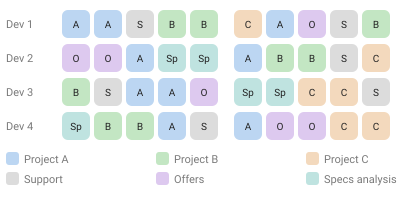
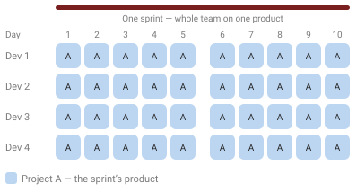

Scrum is everywhere. But most of the advice assumes one dedicated team building one long-lived product. A web agency rarely looks like that. So: does Scrum really work in a web agency? This is my take, from years of running it (and adapting it) in one — first shared as a talk at T3CON19. I still don't have a tidy yes/no, and I've come to think that's the honest answer.

## A step back: Waterfall vs Scrum

- **Waterfall** assumes you can plan everything up front and keep it all under control for the whole build.
- **Scrum** assumes you learn from feedback and mistakes — "adapt and evolve." Sprint after sprint, the product and the team get better and faster.

The real dividing line is **change**. Waterfall bets the requirements will hold still; Scrum assumes they won't. Scrum *embraces* change as part of the process — every sprint is a chance to re-plan on what you just learned, instead of treating a mid-project change as a failure of the plan. So Scrum is most valuable exactly where change is constant: unclear or evolving requirements, new problems surfacing, priorities shifting under you. Where the requirements are truly stable and known up front, its ceremony buys you less.

Scrum is a **framework to develop complex products**. Which raises the real question.

## What is a "complex product," anyway?

There's no clean definition. It might be something that is:

- hard to build, new, or innovative;
- outside the team's or agency's usual knowledge;
- many weeks of work (and *how* many is "many"?);
- entangled with other software and teams;
- full of requirements and customizations that keep shifting the complexity.

Better to work it out for *your* context:

- Is building a TYPO3 site complex for you? (swap TYPO3 for your usual stack)
- Is a 4-sprint product complex? 10 sprints? 50?
- For a team of 7? For two or more teams?

### A quick budget reality check

For a 7-person team (5 devs, 1 PO, 1 SM):

- 7 × 40h = **280h per week**
- a 2-week sprint ≈ **560h**
- a 10-sprint build ≈ **5,600h**

Multiply by your average hourly cost. That's the scale Scrum was built for. If your stomach dropped a little at that number, so did mine — and that reaction is worth sitting with, because it's exactly the scale most agency projects never reach.

Which leaves me with a question I keep turning over: if almost none of my projects hit that scale, am I really doing Scrum, or just holding meetings in its name?

## The typical web agency

Now the reality most agencies live in:

- small projects, low budgets, small teams;
- many projects at once; the PO/PM is always busy;
- old projects to support; budgets that drift out of control;
- pre-estimations for contract negotiation, so it's really "waterfall-ish";
- stakeholders and designers outside the Scrum process;
- meetings everywhere, external teams, Scrum only half-implemented.

**A root cause of many problems: the PO is always busy.** In an agency the PO juggles several projects, stakeholders, requests and phone calls. They often can't attend Scrum events. Stories end up badly written — more task than story — and the PO decides not just *what* to do but *how*.

### The Tetris problem

A team in an agency rarely gets to sit on one project. Leads, support and "just a quick fix" keep dropping in, so the two weeks become a game of **Tetris**: you slot in whatever falls next, switching context almost every day. Each switch has a cost — reloading the problem, the code, the client's intent. Real focus needs *consecutive* days on the same thing, and that only happens when things are calm. When they are, protect it: give the team a few days in a row on one project and let it actually concentrate.

I'm not fully sure this is even solvable in a busy agency, though. Maybe the switching is the job, and the honest goal is to make it less painful rather than pretend we can banish it. Ask me again in a year.

Now the opposite — what a real Scrum sprint looks like: one team, one product, the whole two weeks. Everyone pulls in the same direction and gets to focus.

## Web-agency Scrum vs complex-product Scrum

| Web agency | Complex product |
| --- | --- |
| Multiple parallel projects | One team fully dedicated to one product |
| Non-consecutive sprint timelines | Long-term development |
| Team detached from designers and stakeholders | Team commitment |
| Constant interruptions for leads and support | A feedback culture and retrospectives that improve team and product |
| Short-term, low-budget projects | Enough "heads" for new ideas and brainstorming |
| Scrum events quietly dropped | |

> If the only tool you have is a hammer, everything looks like a nail.

## Where Scrum gives its best

- long-term products, more than ~10 sprints;
- mid-size teams of 5–7 developers;
- a fully dedicated PO;
- CI/CD in place;
- an agile environment — stakeholders included;
- genuinely complex product development.

## Some ideas from experience

A few general suggestions first:

- Promote **ownership** inside the team.
- Let the team collaborate with the client — but protect it at the same time.
- Devs: ask *why* — the benefit, the reason, the goal.
- Focus on **one project per team** at a time; cut unnecessary meetings.
- Give the team a **constant pace**.

### Idea 1 — keep Scrum, scale it down

- Run Scrum in small teams of 2–4 devs.
- Enable and promote the **developer/Scrum-Master** figure.
- Promote a **PO substitute** or representative inside the team.
- Strengthen client collaboration and a culture of feedback.
- Review each story on deployment.
- Add a cross-team retrospective to drive innovation across the agency.

**Works best with** small teams of senior developers, complementary skills, the ability to consult the client, a lean mindset, and no estimates.

**What could go wrong:** teams too small to cover the needed skills; Scrum adapted badly; without dedicated Scrum Masters it degenerates into faulty Scrum. Alter the roles, principles, artefacts and events too far and the "adapted Scrum" collapses.

### Idea 2 — Scrumban

A hybrid: Kanban with some Scrum concepts.

- light pre-planning with a few devs and POs, with estimates;
- a daily in front of the Kanban board;
- pairing or solo dev;
- a weekly pace — a Monday–Friday "sprint";
- a recap at the end of the week; clean the board;
- an agency retrospective once or twice a month.

**Works best for** support tasks, small features (1–2 weeks max), work that needs no brainstorming — for example, right after a go-live.

**What could go wrong:** it isn't Scrum. Less collaboration between developers, knowledge fragmentation, and if a truly scrum-able project arrives it's hard to switch back. Tasks can drift over stories, and developers lose the chance to offer their consulting experience.

## Other techniques worth stealing

- **Deploy and learn** from the market — don't just fulfil client requests.
- **Lean development** and a **Minimal Viable Product (MVP)**.
- **MoSCoW** prioritisation — Must, Should, Could, Won't.
- Explicit **goals and benefits** for every story and task.
- **Never compromise on quality.**
- **No-estimates Scrum** — stop spending time on estimates, focus on building. Works well with spikes and small expert teams; it's a big change where estimates are treated as sacred.
- **Spikes** — a fixed-time exploration task to make an unknown less unknown; the output is a better-defined story in the backlog.
- **Mob programming** — the whole team on one thing, one screen; an intense brainstorming-and-building session.
- **Integrate designers** into the dev team — into the events, into pairing and mobbing.

## So, does it work?

Scrum works in a web agency — but rarely by the book. Pick the honest version: full Scrum where a project is genuinely complex and a team can commit; a scaled-down Scrum for small senior teams; Scrumban for support and quick features. The failure mode isn't choosing one of these — it's pretending you're doing Scrum while quietly dropping the parts that make it work.

That's my current best guess, not a verdict. I might be wrong about where the line sits between "adapted Scrum" and "not Scrum any more," and I'd genuinely like to hear where others draw it. Ask me again in a year and the answer may have moved.

*Based on my T3CON19 talk, "Scrum for web agencies — does it really work?"*
