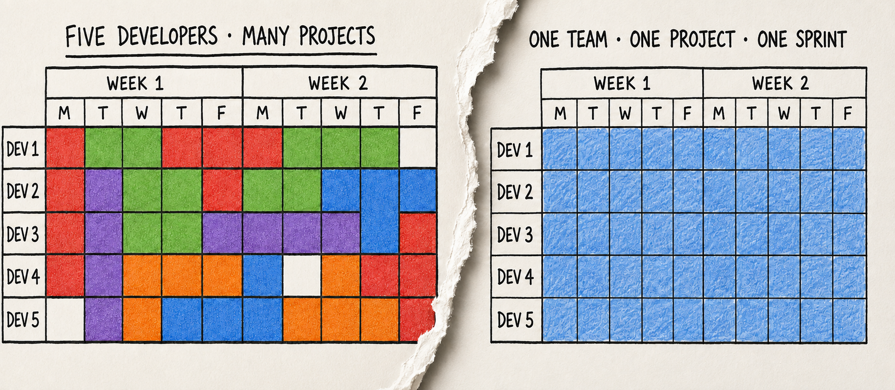
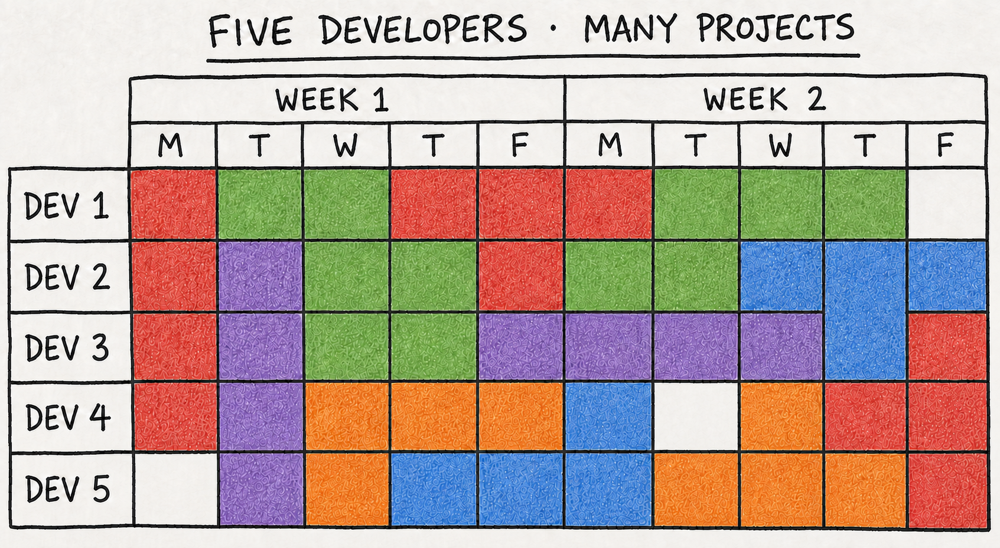
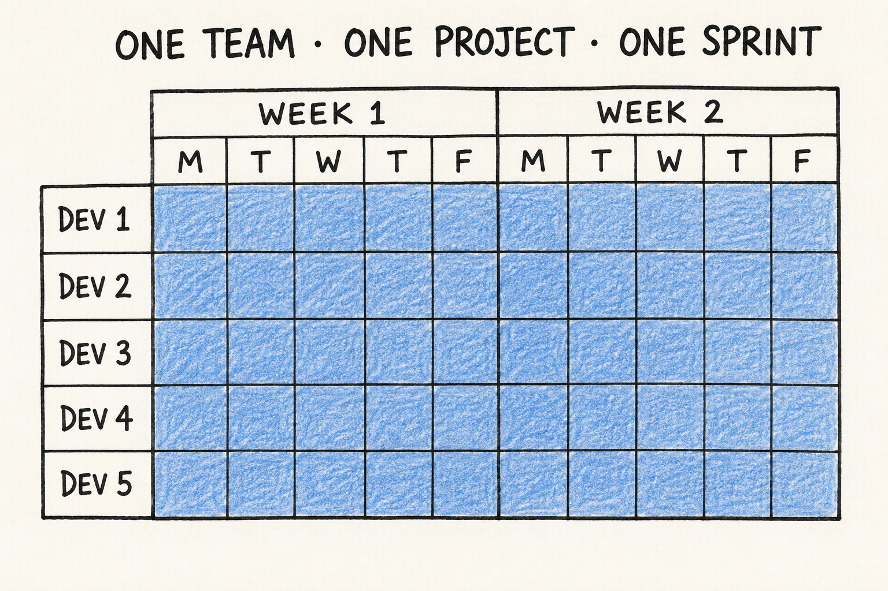

Scrum is everywhere. But most of the advice assumes one dedicated team building one long-lived product. A web agency rarely looks like that. So: does Scrum really work in a web agency? This is my take, from years of running it (and adapting it) in one — first shared as a talk at T3CON19. I still don't have a tidy yes/no, and I've come to think that's the honest answer.

> This started as a T3CON19 talk in 2019. The slides got older. The problem didn't. Still true, still unresolved in 2026

## A step back: Waterfall vs Scrum

- **Waterfall** assumes you can plan everything up front and keep it all under control for the whole build.
- **Scrum** assumes you learn from feedback and mistakes — "adapt and evolve." Sprint after sprint, the product and the team get better and faster.

The real dividing line is **change**. Waterfall bets the requirements will hold still; Scrum assumes they won't. Scrum *embraces* change as part of the process — every sprint is a chance to re-plan on what you just learned, instead of treating a mid-project change as a failure of the plan. So Scrum is most valuable exactly where change is constant: unclear or evolving requirements, new problems surfacing, priorities shifting under you. Where the requirements are truly stable and known up front, its ceremony buys you less.

Back in 2019 I'd have said Scrum is a **framework to develop complex products** — that's how the Scrum Guide worded it then. The 2020 rewrite quietly changed it: Scrum is now "a lightweight framework that helps people, teams and organizations generate value through **adaptive solutions for complex problems**." "Products" became "problems." It's a small edit with a big point behind it — Scrum isn't defined by the *thing* you ship but by whether the *problem* is too complex to plan up front, so you have to inspect and adapt your way through it (that "empiricism" is the engine). Which raises the real question.

## What is a "complex problem," anyway?

There's no clean definition. It might be something that is:

- hard to build, new, or innovative;
- outside the team's or agency's usual knowledge;
- many weeks of work (and *how* many is "many"?);
- entangled with other software and teams;
- full of requirements and customizations that keep shifting the complexity;
- unpredictable — you can't tell up front what will happen, because priorities keep moving under outside pressure (a competitor ships, the market shifts, the rules change, users do something nobody planned for).

That last one is really the heart of it. The Scrum Guide doesn't talk about "the market" at all, but it is blunt about the underlying thing: "In complex environments, what will happen is unknown." That's the test. If you can reliably plan the whole thing up front, it probably isn't complex — and Scrum's inspect-and-adapt machinery is answering a question you don't have.

Better to work it out for *your* context:

- Is building a TYPO3 site complex for you? (swap TYPO3 for your usual stack)
- Is a 4-sprint product complex? 10 sprints? 50?
- For a team of 7? For two or more teams?

And here's the thing: agencies work hard to make sure the answer is *no*. We reuse the same tech stack across projects on purpose — for efficiency, shared knowledge, a battle-tested setup you can spin up in an afternoon. The whole point is to turn each new site into a *known* problem, not a novel one. A small-to-mid web project usually ends up as 1–2 developers plus a designer dipping in for a few hours here and there — nowhere near the dedicated seven-person team Scrum imagines. So by its own definition, most of what an agency ships isn't a "complex problem" at all. That's not a failure — it's the efficiency working as intended. It just means the thing Scrum is *for* often isn't the thing in front of us.

### A quick budget reality check

For a 7-person team (5 devs, 1 PO, 1 SM):

- 7 × 40h = **280h per week**
- a 2-week sprint ≈ **560h**
- a 10-sprint build ≈ **5,600h**

Multiply by your average hourly cost. That's the scale Scrum was built for. If your stomach dropped a little at that number, so did mine — and that reaction is worth sitting with, because it's exactly the scale most agency projects never reach.

Which leaves me with a question I keep turning over: if almost none of my projects hit that scale, am I really doing Scrum, or just holding meetings in its name?

## The typical web agency

Now the reality most agencies live in:

- small projects, low budgets, small teams;
- many projects at once; the PO/PM is always busy;
- old projects to support; budgets that drift out of control;
- pre-estimations for contract negotiation, so it's really "waterfall-ish";
- stakeholders and designers outside the Scrum process;
- meetings everywhere, external teams, Scrum only half-implemented.

**A root cause of many problems: the PO is always busy.** In an agency the PO juggles several projects, stakeholders, requests and phone calls. They often can't attend Scrum events. Stories end up badly written — more task than story — and the PO decides not just *what* to do but *how*.

## The hidden cost: people and knowledge

- **Burnout** — constant switching + an overloaded PO + the pressure of "just a quick fix" landing in the sprint grinds people down; the "constant pace" idea exists precisely to push back on this.

- **Onboarding** — a new dev joining lands in a soup of half-known projects with scattered context; "knowledge fragmentation" isn't just a Scrumban risk, it's the baseline state.

- **Documentation** — every project needs its own context captured, nobody has time, so the doc that exists is stale; this is a real, unaddressed tax of parallelism (and arguably where AI tooling genuinely helps — auto-generated context/ADRs).

- **Technical debt** — the flip side of all that stack reuse. A shared, battle-tested setup is a huge efficiency win, but "just a quick fix" keeps skipping the refactor, no single team owns a codebase long enough to keep it clean, and no one's sprint has budget to pay debt down. So it compounds quietly — worst of all on the old projects you're still on the hook to support. And because the stack is shared, a shortcut taken on one project can quietly become everyone's problem on the next.

### The Tetris effect

A team in an agency rarely gets to sit on one project. Leads, support and "just a quick fix" keep dropping in, so the two weeks become a game of **Tetris**: you slot in whatever falls next, switching context almost every day. Each switch has a cost — reloading the problem, the code, the client's intent. And it's a measurable one: a study of programmers found it takes **10–15 minutes to start editing code again after an interruption**, and a developer gets maybe one uninterrupted two-hour stretch in a day ([Parnin & Rugaber](https://chrisparnin.me/pdf/parnin-icpc09.pdf)). Real focus needs *consecutive* days on the same thing, and that only happens when things are calm. When they are, protect it: give the team a few days in a row on one project and let it actually concentrate.

I'm not fully sure this is even solvable in a busy agency, though. Maybe the switching is the job, and the honest goal is to make it less painful rather than pretend we can banish it. Ask me again in a year.

Now the opposite — what a real Scrum sprint looks like: one team, one product, the whole two weeks. Everyone pulls in the same direction and gets to focus.

## Web-agency Scrum vs complex-problem Scrum

| Web agency | Complex problem |
| --- | --- |
| Multiple parallel projects | One team fully dedicated to one product |
| Non-consecutive sprint timelines | Long-term development |
| Team detached from designers and stakeholders | Team commitment |
| Constant interruptions for leads and support | A feedback culture and retrospectives that improve team and product |
| Short-term, low-budget projects | Enough "heads" for new ideas and brainstorming |
| Scrum events quietly dropped | |

> If the only tool you have is a hammer, everything looks like a nail.

## Where Scrum gives its best

- long-term products, more than ~10 sprints;
- mid-size teams of 5–7 developers;
- a fully dedicated PO;
- CI/CD in place;
- an agile environment — stakeholders included;
- a genuinely complex problem — one you can't fully plan up front.

## Some ideas from experience

A few general suggestions first:

- Promote **ownership** inside the team.
- Let the team collaborate with the client — but protect it at the same time.
- Devs: ask *why* — the benefit, the reason, the goal.
- Focus on **one project per team** at a time; cut unnecessary meetings.
- Give the team a **constant pace**.

### Idea 1 — keep Scrum, scale it down

- Run Scrum in small teams of 2–4 devs.
- Enable and promote the **developer/Scrum-Master** figure.
- Promote a **PO substitute** or representative inside the team.
- Strengthen client collaboration and a culture of feedback.
- Review each story on deployment.
- Add a cross-team retrospective to drive innovation across the agency.

**Works best with** small teams of senior developers, complementary skills, the ability to consult the client, a lean mindset, and no estimates.

**What could go wrong:** teams too small to cover the needed skills; Scrum adapted badly; without dedicated Scrum Masters it degenerates into faulty Scrum. Alter the roles, principles, artefacts and events too far and the "adapted Scrum" collapses.

### Idea 2 — Scrumban

A hybrid: Kanban with some Scrum concepts.

- light pre-planning with a few devs and POs, with estimates;
- a daily in front of the Kanban board;
- pairing or solo dev;
- a weekly pace — a Monday–Friday "sprint";
- a recap at the end of the week; clean the board;
- an agency retrospective once or twice a month.

**Works best for** support tasks, small features (1–2 weeks max), work that needs no brainstorming — for example, right after a go-live.

**What could go wrong:** it isn't Scrum. Less collaboration between developers, knowledge fragmentation, and if a truly scrum-able project arrives it's hard to switch back. Tasks can drift over stories, and developers lose the chance to offer their consulting experience.

## Other techniques worth stealing

- **Deploy and learn** from the market — don't just fulfil client requests.
- **Lean development** and a **Minimal Viable Product (MVP)**.
- **MoSCoW** prioritisation — Must, Should, Could, Won't.
- Explicit **goals and benefits** for every story and task.
- **Never compromise on quality.**
- **No-estimates Scrum** — stop spending time on estimates, focus on building. Works well with spikes and small expert teams; it's a big change where estimates are treated as sacred.
- **Spikes** — a fixed-time exploration task to make an unknown less unknown; the output is a better-defined story in the backlog.
- **Shape Up's "appetite"** — Basecamp's idea of fixing the *time* and letting the *scope* flex, instead of estimating scope and letting time blow out. That maps almost too neatly onto agency reality, where the budget is fixed before anyone writes a line. Six-week cycles and no backlog probably don't survive contact with an agency, but the appetite trick might. ([Shape Up](https://basecamp.com/shapeup) is a free book.)
- **Mob programming** — the whole team on one thing, one screen; an intense brainstorming-and-building session.
- **Integrate designers** into the dev team — into the events, into pairing and mobbing.

## So, does it work?

Scrum works in a web agency — but rarely by the book. Pick the honest version: full Scrum where a project is genuinely complex and a team can commit; a scaled-down Scrum for small senior teams; Scrumban for support and quick features. The failure mode isn't choosing one of these — it's pretending you're doing Scrum while quietly dropping the parts that make it work.

That's my current best guess, not a verdict. I might be wrong about where the line sits between "adapted Scrum" and "not Scrum any more," and I'd genuinely like to hear where others draw it. Ask me again in a year and the answer may have moved.

*Based on my T3CON19 talk, "Scrum for web agencies — does it really work?"*

## What's changed since 2019

AI makes the piece feel current rather than evergreen-but-dated. The core argument: AI speeds up the *work* but doesn't touch the *structural* agency problems (overloaded PO, context switching, the Tetris effect) — if anything, faster output can make the switching worse.

The 2025 DORA report puts numbers on the shape of it: AI use correlates with *higher* delivery throughput but *lower* stability, and the teams that actually gain are the ones that already had strong feedback loops and small batches. Their phrase for it is "a mirror and a multiplier" — it amplifies whatever your process already is. A healthy team gets faster; a chaotic one gets faster at being chaotic. That's the whole point: AI is a force multiplier on the *work*, not a fix for the *structure*. ([DORA 2025](https://cloud.google.com/blog/products/ai-machine-learning/announcing-the-2025-dora-report))

Where AI does move the needle is lowering the team size needed to ship, which relocates (not erases) the threshold where full Scrum pays off. That connects to how I think about AI-assisted development more broadly — see [Foundations of AI-assisted software development](/articles/foundations-of-ai-assisted-software-development/).

## I still love Scrum (and don't trust the funerals)

Let me put my bias on the table: I still love Scrum. Done right — one team, one product, a real PO — it's the best way I know to build something genuinely hard. Everything above is me picking at *where it fits*, not arguing it doesn't work.

So I'm wary of the whole genre of article announcing it's dead. Three of the links below are titled, roughly, *Scrum Is Dead*, *Scrum Is Failing*, and *Agile's Quarter-Century Crisis* — and yes, I'm about to recommend you read them anyway. Two things keep me from buying the obituary:

- **The incentive.** "It mostly works, if you do the boring parts" gets no clicks. A funeral does. It feels like the only way to earn attention now is to diss something and start a fight — and "X is dead" is the cheapest fight there is.
- **The data reads as *undone*, not *dead*.** Summaries of the 18th State of Agile Report put teams with agile "deeply embedded" at only around 13%, with most struggling to deliver reliably. That's not a framework dying — it's one rarely practised as designed, which is the argument of this whole piece. (Numbers via secondary summaries; I haven't read the primary report myself, so take them lightly.)

So: not dead. Often done badly, sometimes aimed at work it was never built for — but when it fits, still the real thing.

## Further reading

- [My original T3CON19 slides — Scrum for web agencies: does it really work?](https://www.slideshare.net/slideshow/t3con-19-scrum-for-web-agencies-does-it-really-work/183596318)
- [Giordano Randone — Why Scrum Is Dead: An Obituary from the Field](https://www.giordanorandone.de/blog/why-scrum-is-dead-an-obituary-from-the-field)
- [SPR — The Contemporary Application of Agile: Scrum Is Failing](https://spr.com/the-contemporary-application-of-agile-scrum-is-failing-part-1/)
- [Scrum.org — Agile's Quarter-Century Crisis](https://www.scrum.org/resources/blog/agiles-quarter-century-crisis)
