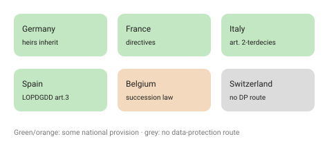

A self-reflection on what happens to our digital lives when we die

I recently lost someone close.

After they passed away, I had to deal with their computer, phone, and online accounts—trying to figure out what to close, what to keep, and what to pass on.

I couldn’t get into their computer or unlock their phone, so even reaching their contacts came down to asking around.

I’m the only heir, so the physical stuff is straightforward. But it made me wonder:

Does that also mean I have the right to their digital life?

What about emails, WhatsApp, cloud photos, or saved passwords—and all the data that involves other people?

Unlike things like houses or cars, a digital life doesn’t really fit into inheritance rules in a clean way. At least not to my knowledge.

Then there’s GDPR. As far as I understand, it doesn’t really apply after someone dies, so it’s mostly up to national law.

But in practice, does inheritance actually give you access to emails, private messages, or cloud accounts—or are those still controlled by platform terms and privacy rules?

I honestly don’t know, and that’s kind of the point.

We’ve built these really complex digital lives, but what happens to them after death is still pretty unclear.

Some platforms do offer legacy tools, but they’re all over the place and not really connected.

Maybe what we need is something like a “digital will”:

Who gets access? What gets saved or deleted? Who takes care of the accounts?

And more broadly: what should actually happen to someone’s digital traces?

Death already leaves enough behind. Technology shouldn’t make it harder for the people who are left.

---

## What I found when I looked into it

A little digging confirmed the mess — but also turned up a few concrete things worth knowing.

GDPR really does stop at death. Recital 27 says the regulation "does not apply to the personal data of deceased persons," and leaves the question to each member state. ([Recital 27](https://gdpr-info.eu/recitals/no-27/)) So in Europe there is no single answer — it is a patchwork, and it varies more than I expected:

- **Germany** — no special "digital death" law; it runs through ordinary inheritance. In 2018 the Federal Court of Justice ruled that a deceased person’s Facebook account passes to the heirs as part of the estate — and later, that this means real access to the account, not just a data export. ([Library of Congress](https://www.loc.gov/item/global-legal-monitor/2018-09-07/germany-federal-court-of-justice-rules-digital-social-media-accounts-inheritable/))
- **France** — you can leave directives about what happens to your data after you die, under the 2016 "République numérique" law (now art. 85 of the data-protection act); without them, heirs can still act to settle the estate. ([CNIL](https://www.cnil.fr/fr/mort-numerique-effacement-informations-personne-decedee))
- **Italy** — heirs, a representative, or family "for reasons worthy of protection" can exercise the deceased’s data rights (Codice Privacy art. 2-terdecies) — unless the person barred it in writing while alive. ([Garante](https://www.garanteprivacy.it/temi/internet-e-nuove-tecnologie/eredita-digitale))
- **Spain** — relatives, partners, heirs or people the deceased designated can access, correct or erase their data (LOPDGDD art. 3), unless they had forbidden it. ([AEPD](https://www.aepd.es/preguntas-frecuentes/0-conceptos-basicos/FAQ-0011-sobre-datos-personales-de-personas-fallecidas))
- **Belgium** — no specific rule; access flows through ordinary succession law, so the accounts pass to the legal heirs (and only to them). ([ICT-recht](https://www.ictrechtswijzer.be/en/heirs-can-access-the-deceaseds-digital-accounts/))
- **Switzerland** (outside the GDPR) — the revised FADP, in force since September 2023, protects only the living, so there is no data-protection route at all; access goes through inheritance law, with heirs stepping into the deceased’s contracts. ([DLA Piper](https://www.dlapiperdataprotection.com/?t=law&c=CH))

I am a developer, not a lawyer — this is what I found, not legal advice, and the details (even article numbers) shift over time. But the shape is clear: some countries let you plan ahead, some lean on the heirs, and one — mine, Switzerland — offers no data-protection help at all.

**The platforms each built their own tool — and they don't talk to each other:**

- **Google — Inactive Account Manager.** You set an inactivity deadline (e.g. 3 or 12 months); after it, Google can share chosen data with people you named, or delete the account.
- **Apple — Legacy Contact.** You generate an access key and give it to someone you trust; after you die they use that key plus a death certificate to request your data.
- **Facebook/Instagram — memorialization + Legacy Contact.** An account can be memorialized (preserved) or removed; a legacy contact can manage the memorialized profile within limits.
- **Password managers** (1Password, Bitwarden and others) have their own emergency-access / legacy features — often the real key, since they hold everything else.

The catch: every one of these is **opt-in and must be set up in advance.** Do nothing, and your heirs are left where I was — locked out, asking around.

So the "digital will" isn't just a nice idea; it's the practical fix available today: turn on each platform's legacy feature now, write down who gets access to what, and keep it somewhere your people can actually reach.

And here's the knot underneath all of it: most of us in Europe live our digital lives on **US products** — Gmail, iCloud, WhatsApp, Meta. So even where a European law grants an heir a right to the data, the account itself sits under a US company's terms of service and, often, foreign jurisdiction. Which one actually wins — my national inheritance right, or the platform's contract and the law it answers to? I genuinely don't know. It's an open conflict between regional rights and international platforms — and it's the part that unsettles me most.

### Sources

- [GDPR — Recital 27 (data of deceased persons)](https://gdpr-info.eu/recitals/no-27/)
- Germany: [Library of Congress — BGH: social-media accounts are inheritable](https://www.loc.gov/item/global-legal-monitor/2018-09-07/germany-federal-court-of-justice-rules-digital-social-media-accounts-inheritable/)
- France: [CNIL — mort numérique](https://www.cnil.fr/fr/mort-numerique-effacement-informations-personne-decedee)
- Italy: [Garante — eredità digitale](https://www.garanteprivacy.it/temi/internet-e-nuove-tecnologie/eredita-digitale)
- Spain: [AEPD — datos de personas fallecidas](https://www.aepd.es/preguntas-frecuentes/0-conceptos-basicos/FAQ-0011-sobre-datos-personales-de-personas-fallecidas)
- Belgium: [ICT-recht — heirs can access the deceased’s digital accounts](https://www.ictrechtswijzer.be/en/heirs-can-access-the-deceaseds-digital-accounts/)
- Switzerland: [DLA Piper — data protection in Switzerland (revFADP)](https://www.dlapiperdataprotection.com/?t=law&c=CH)
- Platforms: [Everplans — Apple Digital Legacy](https://www.everplans.com/articles/apple-ios-15-digital-legacy-program-offers-some-control-over-an-account-after-death-follows-efforts-from-facebook-and-google) · [Nolo — legacy contacts](https://www.nolo.com/legal-encyclopedia/how-to-add-legacy-contacts-to-your-accounts.html)
