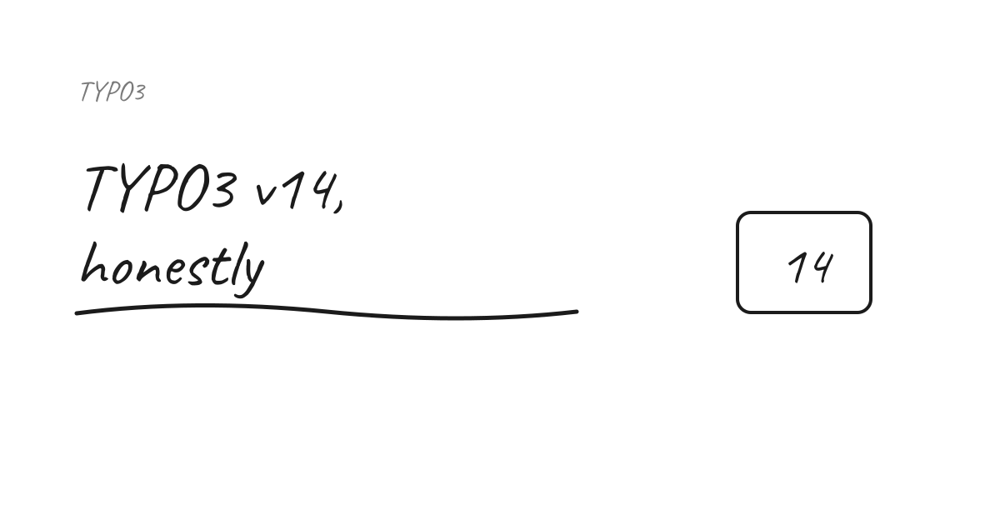
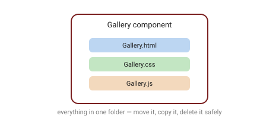

TYPO3 v14 is a big release — and, unusually, a big one for **integrators**: the people working at the seam between backend and frontend. The keynote features get the headlines, but the day-to-day wins are spread across dozens of smaller changes. Here's my tour of what actually changes how you work, gathered from the T3DD26 talks.

I've not shipped a full v14 project yet, so treat this as notes from the talks plus a bit of tinkering, not a battle report. The question I kept asking in every session: does this actually remove work, or just move it somewhere new?

## The sitepackage gets much simpler

A sitepackage is still just an extension — but in v14 it needs **only a `composer.json`** (no more `ext_emconf.php`). Building on the **Site Sets** introduced in v13, a full frontend is now a handful of files:

- `config.yaml` — a name and label, no dependencies required;
- `page.tsconfig` — the backend layout, each column with an identifier and its allowed content types;
- `setup.typoscript` — genuinely about three lines.

The old `FLUIDTEMPLATE` object is replaced by **`PAGEVIEW`**, and a single `dataProcessing` line — **record transformation** — fetches all the data (images, relations) for an element. Manual data processing all but disappears. After years of hand-writing `DatabaseQueryProcessor` blocks, deleting them felt slightly too easy — I keep expecting to find the catch.

> Worth studying: the **Camino** codebase for the TypoScript patterns (CType → CamelCase template mapping).

## Next-gen Fluid: real components

The headline for integrators (Simon Praetorius's talk). v14 brings **global Fluid components** that co-locate everything they need:

```text
Components/
  Atoms/
  Molecules/
    Gallery.fluid.html
    Gallery.css
    Gallery.js
  Organisms/
```



- Two new files in `Configuration/Fluid/` (`ComponentCollections.php`, `Namespaces.php`) register a **global namespace**, so you can write `<my:molecules.gallery />` in *any* template — with auto-completion.
- Each component starts from an **API** (its arguments): an `Image` component becomes the single place every `` is generated — add responsive handling once, everywhere benefits.
- **Isolation** is the real win: a component carries its own scoped CSS and JS, so you can move, copy, or delete it without breaking the rest of the site.
- Page templates glue it together with the new **`<f:render.contentArea contentArea="{content.main}" />`** (the `content.*` identifiers come straight from the backend layout), and **`<f:render.text>`** handles RTE output.

Frontend assets move to **Vite** at project level: `ddev vite` for hot-reload in dev, a build step on deploy, and dynamic `import()` inside a component so a heavy library (Swiper, say) loads **only** when that component is on the page.

The open question for me is upgrades: how much of an existing v13 sitepackage do you realistically port to components, versus leave alone? I'd want to test this on a real project before promising a clean migration path to anyone.

The end state: integration templates are mostly component calls, almost no raw HTML — and much less friction where frontend and backend meet.

## Content Blocks — now with a GUI

Content Blocks changed how we model content; the new **Content Blocks GUI** (André Kraus) puts a visual editor on top of `friendsoftypo3/content-blocks` and **writes the YAML for you** (v13 + v14).

- Build content elements, record types, page types and reusable "Basics" by configuring **fields through forms**.
- **Import/export** blocks as ZIPs, with conflict detection on re-import.
- ⚠️ Install as a **dev dependency only** — it writes YAML to disk, updates the DB schema and clears caches. Great for authoring, **never for production**; ship only the generated blocks. The warning label is doing a lot of quiet work here, so I'll say it twice: not on production.

## The little gems

The quality-of-life changes that add up (Jigal van Hemert's rapid-fire session):

| Area | Highlights |
| --- | --- |
| **Backend** | File operations in a modal; dashboard widgets with settings; "recently changed pages"; Workspaces show who made the last change; search in translated pages; history rollback now language-aware; content-element preview looks like the frontend |
| **TCA** | Title and label *per type*; restrict content types per `doktype`; new `searchable` field option |
| **TypoScript** | Allowed/disallowed content types per column; control content-element order; `PAGEVIEW` resolves records incl. FlexForm |
| **CLI** | Autocomplete; `cache:warmup` compiles every `.fluid` file and **checks template syntax** (handy in deployment) |

## Things that are gone (plan your upgrade)

- **`$GLOBALS['TSFE']` is gone.**
- **`CType`'s `list_type` is gone.**
- `compressionLevel`, and **CSS/JS concatenation**, removed.
- Extbase now always updates the reference index; validators for controller action parameters; the upgrade-wizard interface moved into core.

## Takeaway

Most of these patterns — components, co-location, isolation, code-splitting — have been standard in the wider frontend world for years. v14's real achievement is bringing them into TYPO3 *at the integration seam*, where projects usually get messy. If you're starting a v14 sitepackage, lean into components and the `PAGEVIEW` record API; you'll write far less glue.

That's my current read, anyway. Whether it holds up once I've dragged a real client project through an upgrade is a different question — ask me again in a year.

## Sources

- [Jigal van Hemert — Little Gems in TYPO3 v14 (slides)](https://www.typo3coder.nl/presentations/t3dd26/)
- Simon Praetorius — *Fluid Detected: Next-Gen Templating in TYPO3 v14* (T3DD26)
- [Content Blocks GUI (FriendsOfTYPO3)](https://github.com/FriendsOfTYPO3/content-blocks-gui/)

*Notes from talks at TYPO3 Developer Days 2026 (T3DD26). Verify version specifics against the official TYPO3 v14 docs before relying on them.*
