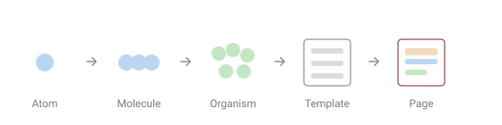

Atomic design is one of those ideas everyone nods at and few actually apply. The name comes from Brad Frost: instead of designing whole pages, you build a UI from small, reusable parts that combine into bigger ones. Here's the model — and where it finally clicked for me, in TYPO3 v14.

## The five levels

- **Atoms** — the smallest pieces: a button, a label, an input, an image tag.
- **Molecules** — a few atoms working together: a search field (label + input + button).
- **Organisms** — larger, self-contained sections: a header, a card grid, a gallery.
- **Templates** — page-level layouts that arrange organisms, without real content.
- **Pages** — templates filled with real content.

The point isn't the taxonomy. It's the direction: **compose upward from small, isolated parts** instead of copy-pasting markup into every page.



## Why it fits component-based work

If you've done any modern frontend, this is just **components** with a naming convention. The value is the same:

- **One source of truth** — the `Image` atom is the only place an `` tag is built. Add lazy-loading or responsive sizes once, and every image benefits.
- **Isolation** — a component owns its markup, styles and behaviour; you can move, copy or delete it without breaking the rest.
- **Reuse** — share the same atoms and molecules across projects; swap a few for a different brand.

## Where it clicked: TYPO3 v14 Fluid components

TYPO3 v14 turned this from a nice diagram into something practical. Fluid components **co-locate** everything a part needs in one folder:

```text
Components/
  Atoms/
    Image.fluid.html
  Molecules/
    Gallery.fluid.html
    Gallery.css
    Gallery.js
  Organisms/
    Header.fluid.html
```

- Each component declares an **API** (its arguments) and is available **globally** — you call `<my:molecules.gallery />` in any template, with auto-completion.
- Scoped CSS and JS live *next to* the template, so nothing leaks. With a Vite build, a heavy dependency can even load only when that component is on the page.
- The atoms/molecules/organisms folders are **a choice, not a requirement** — Fluid doesn't care what you call them.

That last point matters. The page template ends up as mostly component calls, almost no raw HTML — which is exactly what atomic design promised on the whiteboard.

## The honest caveat

Don't turn it into a religion. Teams waste real time arguing whether something is a molecule or an organism. It doesn't matter. The levels are a **guide**, not a law. What delivers the value is the underlying discipline: **small, isolated, well-named, reusable parts, composed upward.** Get that, and you can be loose about the labels.

## Sources

- [Brad Frost — Atomic Design](https://atomicdesign.bradfrost.com/)
- Simon Praetorius — *Fluid Detected: Next-Gen Templating in TYPO3 v14* (T3DD26)

*The TYPO3 specifics come from talks at TYPO3 Developer Days 2026; see also my TYPO3 v14 write-up.*
