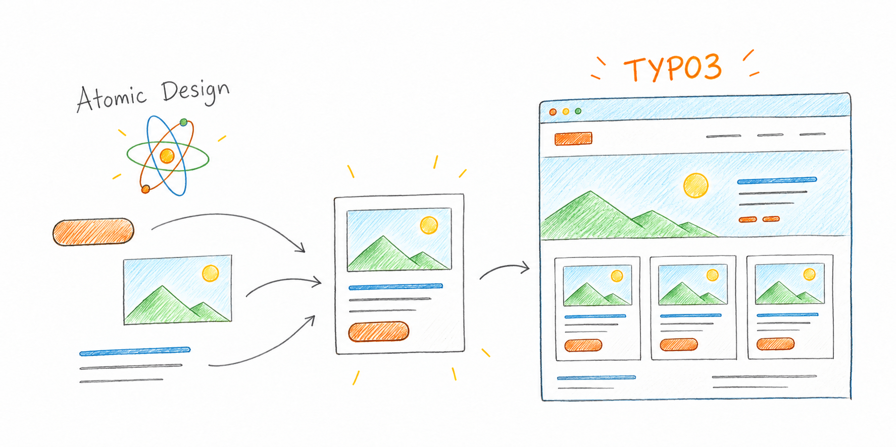

Atomic design is one of those ideas everyone nods at. Few actually apply it. I nodded at it for years without really using it.

[Brad Frost's model](https://atomicdesign.bradfrost.com/) starts with small parts and combines them into larger ones. Atoms, molecules, organisms, templates and pages give us a vocabulary. That is enough theory for this article.

I wanted a clean way to apply this in TYPO3. Templates and partials were useful. But I wanted a clearer component architecture. Fluid components in TYPO3 v14 finally give me an approach I like.

## From extension templates to shared UI

TYPO3 has used Fluid templates and partials for years. I mostly used partials to split large templates and avoid repeated markup. To make plugins look consistent, I adapted their markup and Sass in the site package.

With components, I organise around the shared UI element. Here is a comparison inside one `EXT:sitepackage`:

| Templates and partials | Shared atomic components |
| --- | --- |
| **Template overrides**<br>`Resources/Private/Templates/Solr/`<br>`Resources/Private/Templates/Powermail/`<br>`Resources/Private/Templates/Content/` | **The same templates consume a shared component**<br>`Resources/Private/Templates/Solr/`<br>`Resources/Private/Templates/Powermail/`<br>`Resources/Private/Templates/Content/` |
| **Separate button partials**<br>`Resources/Private/Partials/Solr/Button.html`<br>`Resources/Private/Partials/Powermail/Button.html`<br>`Resources/Private/Partials/Content/Button.html` | **One button atom**<br>`Resources/Private/Components/Atom/Button/Button.fluid.html` |
| **Styles organised by integration**<br>`Resources/Private/Sass/Solr.scss`<br>`Resources/Private/Sass/Powermail.scss`<br>`Resources/Private/Sass/Content.scss` | **Shared component styles**<br>`Resources/Public/Components/Atom/Button/Button.scss` |
| **Each template calls its partial**<br>`<f:render partial="Solr/Button" />` | **All three call the same atom**<br>`<ui:atom.button type="submit">Search</ui:atom.button>` |

These paths are examples. They still need configuring for each plugin. Partials can also be shared across extensions. Here I want one button, one API and one Sass source. Templates and partials still compose the surrounding content.

## A shared button as a Fluid component

I define the button's markup and API once. Solr, Powermail and Content Blocks can then use the same component.

I register the collection in the site package's `Configuration/Fluid/ComponentCollections.php`:

```php
<?php

return [
    'Acme\\Sitepackage\\Components' => [
        'templatePaths' => [
            10 => 'EXT:sitepackage/Resources/Private/Components',
        ],
    ],
];
```

The array key defines the component namespace. `templatePaths` points to the collection root. The tag `<ui:atom.button>` maps to `Resources/Private/Components/Atom/Button/Button.fluid.html`. Each part of the tag becomes a folder. The final folder contains a `.fluid.html` file with the same name.

The Fluid template stays in the private collection. In this example, Sass lives under `Resources/Public`. Its path and the build output are project choices:

```text
EXT:sitepackage/Resources/
  Private/
    Components/
      Atom/
        Button/
          Button.fluid.html
  Public/
    Components/
      Atom/
        Button/
          Button.scss
    Build/
      atom-button.css
```

The component defines the arguments it accepts. The slot contains the button label or other child markup:

```html
<f:argument name="variant" type="string" optional="{true}" default="primary" />
<f:argument name="type" type="string" optional="{true}" default="button" />

<button
    class="c-button c-button--{variant}"
    type="{type}"
>
    <f:slot />
</button>
```

A template imports the collection namespace. It can then call the button as a tag:

```html
<html
    xmlns:ui="http://typo3.org/ns/Acme/Sitepackage/Components"
    data-namespace-typo3-fluid="true"
>

<ui:atom.button variant="primary" type="submit">
    Search
</ui:atom.button>
```

The local `xmlns` declaration works across TYPO3 v14. From v14.1, I can also register a global namespace in `Configuration/Fluid/Namespaces.php`:

```php
<?php

return [
    'ui' => ['Acme\\Sitepackage\\Components'],
];
```

Templates can then call `<ui:atom.button>` without repeating `xmlns`. A local declaration makes the dependency visible. A global declaration makes the collection available across the site.

Different templates can call the same component:

```html
<!-- Solr search form -->
<ui:atom.button type="submit">Search</ui:atom.button>
```

```html
<!-- Powermail form -->
<ui:atom.button type="submit">Send message</ui:atom.button>
```

The button is an atom. A search form can use it inside a molecule. Here is `Molecule/SearchForm/SearchForm.fluid.html`. It declares its arguments and imports the same namespace:

```html
<html
    xmlns:ui="http://typo3.org/ns/Acme/Sitepackage/Components"
    data-namespace-typo3-fluid="true"
>

<f:argument name="action" type="string" />
<f:argument name="label" type="string" />
<f:argument name="submit" type="string" optional="{true}" default="Search" />
<f:argument name="query" type="string" optional="{true}" default="" />
<f:argument name="fieldId" type="string" />

<form action="{action}" method="get" role="search">
    <label for="{fieldId}">{label}</label>
    <input id="{fieldId}" type="search" name="q" value="{query}" />
    <ui:atom.button type="submit">{submit}</ui:atom.button>
</form>
</html>
```

A page template supplies the data:

```html
<ui:molecule.searchForm
    action="/search"
    label="Search this site"
    fieldId="global-search"
    query="{searchTerm}"
/>
```

The form defines the structure and uses the shared button. This is an example of composition. A real Solr or Powermail form must follow that plugin's API. Its action, field names and hidden fields may differ.

Each template supplies the label and chooses a variant. The button component defines the markup and style classes. That keeps its appearance consistent across extensions.

Partials help me reuse markup. Components give shared UI elements an explicit API. Both have a place in the project.

## A link that looks like a button

A teaser's “Read more” control looks like a button. It opens another page, so it should render an `<a>`. A form action uses a `<button>`. Both can be atoms.

I prefer two components: `Button` and `ButtonLink`. They share styles but have separate APIs. One component could switch between both tags. I find separate calls easier to read.

In `EXT:sitepackage/Resources/Private/Components/Atom/ButtonLink/ButtonLink.fluid.html`:

```html
<f:argument name="link" type="mixed" />
<f:argument name="variant" type="string" optional="{true}" default="primary" />

<f:link.typolink parameter="{link}" class="c-button c-button--{variant}">
    <f:slot />
</f:link.typolink>
```

The `link` argument accepts a TYPO3 link parameter. It also accepts the object from Content Blocks. [The Typolink ViewHelper](https://docs.typo3.org/other/typo3/view-helper-reference/main/en-us/Global/Link/Typolink.html) resolves it and renders an anchor. The result remains a navigation link.

Both atoms use the same `c-button` classes. Their shared styles live in `Resources/Public/Components/Atom/Button/Button.scss`:

```scss
.c-button {
  display: inline-flex;
  align-items: center;
  justify-content: center;
  padding: 0.75rem 1rem;
  border: 1px solid transparent;
  border-radius: 0.25rem;
  font: inherit;
  text-decoration: none;
  cursor: pointer;

  &--primary {
    color: #fff;
    background: #174ea6;
  }

  &--secondary {
    color: #174ea6;
    background: #fff;
    border-color: currentColor;
  }

  &:focus-visible {
    outline: 3px solid #174ea6;
    outline-offset: 3px;
  }
}
```

The build must include this Sass for both atoms. A shared bundle makes that simple. Separate assets need the integration to track this dependency. The styles only need one definition.

## Content Blocks and shared components

Editors create a teaser with a title, a summary and a destination. The frontend renders it as a molecule with a `ButtonLink` atom. Content Blocks can use components at any Atomic Design level.

A minimal `EXT:sitepackage/ContentBlocks/ContentElements/teaser/config.yaml`:

```yaml
name: acme/teaser
fields:
  - identifier: heading
    type: Text
  - identifier: summary
    type: Textarea
  - identifier: destination
    type: Link
    required: true
    allowedTypes:
      - page
  - identifier: linkLabel
    type: Text
    required: true
```

The [frontend template](https://docs.typo3.org/p/friendsoftypo3/content-blocks/main/en-us/Definition/Templates/Index.html) accesses the fields through `data`. The [Link field](https://docs.typo3.org/p/friendsoftypo3/content-blocks/main/en-us/YamlReference/FieldTypes/Link/Index.html) provides a `TypolinkParameter` object. I pass that object to the atom. TYPO3 resolves the URL.

In `EXT:sitepackage/Resources/Private/Components/Molecule/Teaser/Teaser.fluid.html`:

```html
<f:argument name="heading" type="string" />
<f:argument name="summary" type="string" />
<f:argument name="link" type="mixed" />
<f:argument name="linkLabel" type="string" />

<article class="c-teaser">
    <h3>{heading}</h3>
    <p>{summary}</p>
    <ui:atom.buttonLink link="{link}" variant="secondary">
        {linkLabel}
    </ui:atom.buttonLink>
</article>
```

These examples use the global `ui` namespace shown earlier. With a local namespace, add the declaration to each template. `Teaser.scss` lives in `Resources/Public/Components/Molecule/Teaser/Teaser.scss`. The `<h3>` suits the page below. Another page may need a different heading level.

The Content Block's `templates/frontend.fluid.html` passes its fields to the molecule:

```html
<ui:molecule.teaser
    heading="{data.heading}"
    summary="{data.summary}"
    link="{data.destination}"
    linkLabel="{data.linkLabel}"
/>
```

Content Blocks keeps its private templates under `ContentBlocks/ContentElements/.../templates/`. Shared Fluid components stay in `Resources/Private/Components`. Frontend sources live in `Resources/Public/Components`. The build writes its output to `Resources/Public/Build`.

The same teaser can render data from a page query or a plugin. Its components only need the agreed arguments.

## A page with molecules and organisms

A `TeaserGrid` organism groups several teasers. Its template lives at `EXT:sitepackage/Resources/Private/Components/Organism/TeaserGrid/TeaserGrid.fluid.html`:

```html
<f:argument name="heading" type="string" />
<f:argument name="items" type="array" />

<section class="c-teaser-grid">
    <h2>{heading}</h2>
    <div class="c-teaser-grid__items">
        <f:for each="{items}" as="item">
            <ui:molecule.teaser
                heading="{item.heading}"
                summary="{item.summary}"
                link="{item.link}"
                linkLabel="{item.linkLabel}"
            />
        </f:for>
    </div>
</section>
```

Its Sass lives in `Resources/Public/Components/Organism/TeaserGrid/TeaserGrid.scss`. The page template at `EXT:sitepackage/Resources/Private/Templates/Page/Landing.html` combines the grid and the search form:

```html
<main>
    <h1>{pageTitle}</h1>

    <ui:molecule.searchForm
        action="/search"
        label="Search this site"
        fieldId="landing-search"
    />

    <ui:organism.teaserGrid
        heading="Explore our services"
        items="{teasers}"
    />
</main>
```

A controller or DataProcessor supplies `pageTitle` and the `teasers` array. Each item has `heading`, `summary`, `link` and `linkLabel`. These variables need setting up. Editors could also place teaser Content Blocks in a content area. The page would render that area through the usual TYPO3 content rendering.

| Level | Component in this page | Composes |
| --- | --- | --- |
| Page template | `Landing.html` | Search form and teaser grid |
| Organism | `TeaserGrid` | A section heading and teaser molecules |
| Molecule | `Teaser` | Title, summary and button-link atom |
| Molecule | `SearchForm` | Label, input and button atom |
| Atom | `ButtonLink` / `Button` | Navigation / form action, sharing visual styles |

The page assembles the larger pieces. The organism arranges the teasers. Each teaser uses the same link styles. One style change updates both teaser links and search buttons.

## What TYPO3 v14 changes

TYPO3 v13 already supported Fluid components through a custom PHP `ComponentCollection`. TYPO3 v14 adds registration through `Configuration/Fluid/ComponentCollections.php`. That removes the PHP boilerplate for common cases. Templates call components as custom Fluid tags. Each component declares its arguments with `<f:argument>`.

The Fluid convention maps tags to templates. Sass and JavaScript paths are project choices. This example keeps templates private and frontend sources public:

```text
EXT:sitepackage/
  Resources/
    Private/
      Components/
        Atom/
          Button/
            Button.fluid.html
          ButtonLink/
            ButtonLink.fluid.html
        Molecule/
          SearchForm/
            SearchForm.fluid.html
          Teaser/
            Teaser.fluid.html
        Organism/
          Header/
            Header.fluid.html
          TeaserGrid/
            TeaserGrid.fluid.html
    Public/
      Components/
        Atom/
          Button/
            Button.scss
        Molecule/
          SearchForm/
            SearchForm.scss
            SearchForm.js
          Teaser/
            Teaser.scss
        Organism/
          Header/
            Header.scss
          TeaserGrid/
            TeaserGrid.scss
      Build/
        ...compiled CSS and JavaScript...
```

`ButtonLink` shares the button styles. It needs no extra Sass file. This asset structure is a project choice. Fluid does not create it or load the assets automatically.

### Do I really want two component trees?

This structure leaves me with a question.

Every component has two places to look. Moving or renaming it may affect both trees. The files differ, but the folder hierarchy repeats. That feels excessive when I want to keep related files together.

I would consider keeping all component sources under `Private/Components`. The build would still write browser assets to `Public`. Generated output needs less manual coordination than two source trees. I wonder how this choice scales in a larger team.

Selective loading is a separate choice. A component can request its CSS and shared dependencies through a TYPO3 integration. That integration needs suitable Vite entries and must read the build manifest. Vite compiles the sources at build time. TYPO3 includes the outputs, ideally once per asset. Source locations do not determine this behaviour. See [Vite's backend integration guide](https://vite.dev/guide/backend-integration.html).

TYPO3's `Resources/Public` also differs from Vite's [special `publicDir`](https://vite.dev/guide/assets.html#the-public-directory). Vite copies `publicDir` files without processing them. Sass needs configured build entries or imports.

The Atomic Design labels are optional too. Fluid does not require all five levels. I would use names and folders that help the team find the components.

## Is Atomic Design just components with a naming convention?

React and Vue developers will recognise this approach. Components provide the implementation. Atomic Design provides a model for composing and organising them.

One source of truth, isolation and reuse come from component architecture. They do not require Atomic Design. The model reminds me to start with useful small parts and build from them.

I do not want a meeting about whether a search form is a molecule or an organism. I've sat in that meeting. Nobody's UI got better for it. The labels should help us work.

## How far up should the abstraction go?

A shared button has a clear payoff. So does a search form. Each has one definition and a clear API. Different templates can use them consistently.

Templates and pages are less clear. A template serves a plugin or content type. A page combines content and project rules. I doubt that every template and page needs a formal Atomic Design label.

That is still a working hunch. What clicked for me was the implementation. I can define a button once and reuse it across Solr, Powermail and Content Blocks. I can build the architecture I wanted without adopting every label.

Atomic Design gave me a useful mental model. TYPO3 v14 finally gave me an implementation I like.

## Sources

- [Brad Frost: Atomic Design](https://atomicdesign.bradfrost.com/)
- [Fluid components integration: TYPO3 Core Changelog](https://docs.typo3.org/c/typo3/cms-core/main/en-us/Changelog/14.1/Feature-108508-FluidComponentsIntegration.html)
- [Using Fluid in TYPO3: namespaces and components](https://docs.typo3.org/m/typo3/reference-coreapi/14.3/en-us/ApiOverview/Fluid/UsingFluidInTypo3.html)
- [Content Blocks: template conventions](https://docs.typo3.org/p/friendsoftypo3/content-blocks/main/en-us/Definition/Templates/Index.html)
- [Content Blocks: Link fields](https://docs.typo3.org/p/friendsoftypo3/content-blocks/main/en-us/YamlReference/FieldTypes/Link/Index.html)
- [Fluid: Typolink ViewHelper](https://docs.typo3.org/other/typo3/view-helper-reference/main/en-us/Global/Link/Typolink.html)
- Simon Praetorius: [*Fluid Detected: Next-Gen Templating in TYPO3 14*](https://t3dd.typo3.com/schedule/sessions/fluid-detected-next-gen-templating-in-typo3-14-1132)

*These TYPO3 examples draw on the v14 documentation and TYPO3 Developer Days 2026 talks. See also my TYPO3 v14 article.*

