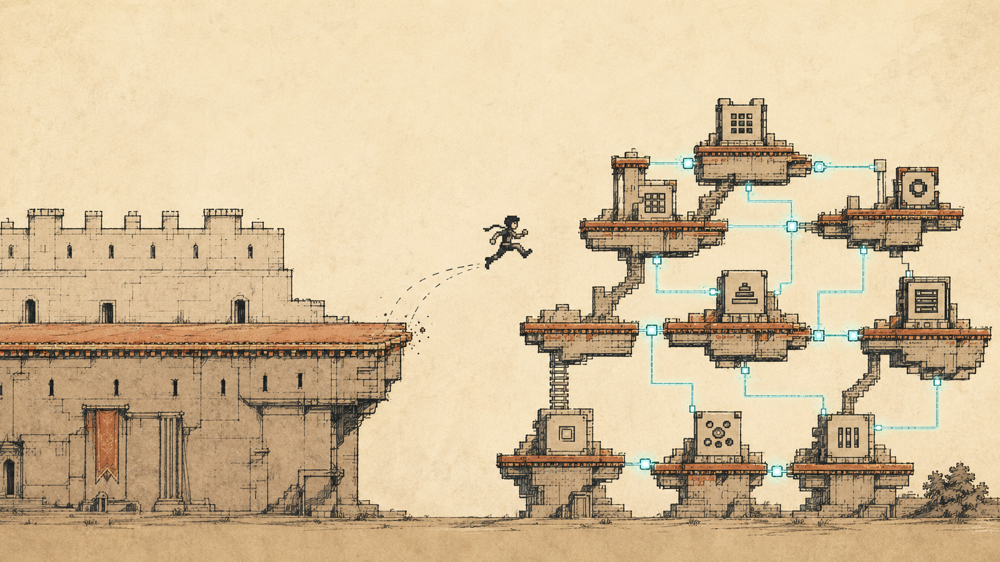
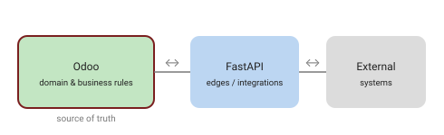

At some point a homegrown app stops being the thing you sell and becomes the thing you maintain. We had a monolithic PHP application — built on **TYPO3**, a CMS with a solid, extensible development framework — carrying years of business processes, and every new requirement meant re-inventing something an ERP already does well. Moving to **Odoo** (a Python/PostgreSQL ERP/CRM) was less about the framework and more about a decision: stop rebuilding invoicing, contacts, workflows and access control by hand, and put our energy into what's actually specific to us.

By the end, the monolith had also become genuinely tangled. Modules depended on each other in ways nobody fully held in their head, so a change in one corner could surface as a surprise in another; updating anything or adding a feature meant tracing threads across half the codebase first. It didn't help that the QA and pipeline never quite reached a good level — coverage had gaps, so regressions had room to slip through. There was a human cost, too: frontend and backend were knotted together, so the frontend developers and the marketing team were effectively blocked on the backend developers — who were always busy on something else. A copy change or a new landing page could end up waiting on a queue it never should have touched. That combination, more than any single missing feature, is what pushed us to rethink the whole shape.

The pain points, in one place:

| Pain point | What it actually meant |
| --- | --- |
| Rebuilding the generic 80% by hand | Invoicing, contacts, workflows and permissions re-implemented instead of reused |
| Tangled, interdependent modules | Nobody fully held the dependencies in their head; one change rippled in surprising places |
| Slow, risky to change | Updating anything or adding a feature meant tracing threads across the codebase first |
| Weak QA & pipeline | Coverage gaps left room for regressions to slip through |
| Frontend and backend knotted together | Frontend devs and marketing were blocked on always-busy backend devs |
| One monolith, one deploy | No safe way to change a part without risking the whole |

None of this was a sudden switch. It started about two years earlier, at the office kitchen table — yes, offices here in Switzerland tend to come with a proper kitchen — sketching the idea on paper for my boss — the drawing that slowly turned into a plan, and then into a team effort. So the "we" here is real: this was never a one-person job, even if the first version of it fit on a napkin.

Here's how we think about it after doing it — with the honest caveat that we're one migration in: enough to have opinions, not enough to be smug about them.

## Why Odoo, not another rewrite

Odoo isn't just an ERP you install — it's an application framework with a strong ORM, a data model, views, workflows and access rights already in place. That matters: the boring 80% (who can do what, how records relate, audit, the admin UI) comes for free, so a rewrite becomes an *incremental migration* instead of a big-bang.

The trap is treating it like a product to configure. Treat it as a **platform to build on**. We started out clicking through settings screens expecting to be "done" — that phase lasted about a week before it was obvious we were building software, not filling in a form.

One thing we're still turning over: where's the line between what you accept as Odoo's opinion and what you bend to fit your business? Configure too much and you're fighting the platform; customise too much and every upgrade hurts. We don't have a clean rule for it yet.

## Put the business logic in custom modules

The single most important habit: **your domain logic lives in your own Odoo modules — never in patched core.**

- Model your entities as Odoo models; use computed fields, constraints and `onchange` for the rules.
- Encode real workflows (states, transitions, what triggers what) in the module, not in a pile of scripts around it.
- Lean on Odoo's access rights and record rules instead of reinventing permissions.
- Keep each concern a separate, installable module with clear dependencies — so it survives upgrades and can be reasoned about on its own.

When the business logic is *inside* Odoo, the ERP's tooling (views, reports, security, the ORM) works with your rules instead of against them. When it's bolted on outside, you fight the platform forever.

## Let FastAPI handle what Odoo shouldn't

Odoo is great at the business domain. It's not always the right place for a fast, custom HTTP surface, a public integration endpoint, or async work talking to external systems. That's where a small **FastAPI** service earns its place, alongside Odoo.

We did consider doing everything inside Odoo controllers and skipping the extra service entirely — one less thing to deploy. What changed our minds was the first high-throughput webhook: forcing it through the ERP's request stack felt like the wrong tool, and a thin FastAPI service was simpler to reason about. Whether that holds for a smaller integration, we're honestly not sure — for a couple of endpoints the extra service might be overkill.

A boundary that worked for us:

- **Odoo owns the domain** — the data and the business rules. It's the source of truth.
- **FastAPI owns the edges** — custom or high-throughput endpoints, webhooks, and bridges to external software that don't belong in the ERP.
- They talk over a clear API (Odoo's, or one you expose), and each side stays in its lane.

A few concrete pieces ended up outside Odoo entirely:

- **The public website** — the frontend that used to be baked into the monolithic PHP CMS became its own thing, no longer tangled up with the business logic behind it. Splitting the site from the system it talks to was one of the clearer wins — and it finally let the frontend and marketing folks ship without queuing behind the backend team.
- **The customer area** — where clients log in and handle their own stuff — became its own front-end layer, consuming FastAPI instead of living inside the ERP. Keeping it separate let us shape the client experience without bending Odoo's back-office UI to do a job it wasn't built for.
- **Identity** — we pulled identity and access management out too, into **Keycloak** as a standalone service reached over an API with JWT auth, rather than leaning on Odoo's login for everything that touches the system. But we deliberately split it: Keycloak answers *who you are*, while the **detailed access rights** — what each client's users are actually allowed to do — live in a dedicated Odoo module. That way clients can administer their own users' permissions right from the account area, and the fine-grained rules stay where the domain already lives. Keycloak and Odoo stay in sync over a dedicated API between the two. Authentication on the outside, domain-specific authorization in Odoo.

Add those up and the real shift becomes clear. We didn't just swap PHP for Odoo; we went from a single **monolithic PHP app** (CMS website and all) to an **API-first** architecture — Odoo as the domain core, FastAPI at the edges, a standalone public website, a separate customer front-end, and Keycloak for identity, all talking over APIs. That reframing, more than the ERP itself, is what actually changed how we build.

The point isn't "microservices everywhere." It's: don't cram every integration into Odoo, and don't leak business rules out into the FastAPI layer. Keep the domain in one place.

## Lessons and gotchas

- **Customisations as modules, not core edits** — the difference between a smooth upgrade and a dreaded one.
- **Respect the ORM** — fighting it with raw SQL is usually a smell; when you do need it, isolate it.
- **Raise the testing bar on purpose** — the old monolith's QA and pipeline never really got there, and the gaps showed up as regressions. This time we set stricter test-coverage rules from the start — at least for Odoo and FastAPI, which are my area of competence; I can't honestly vouch for every layer, but where I could set the bar, I set it higher.
- **Draw the Odoo ↔ FastAPI line deliberately** — re-litigating it per feature is where integrations rot.
- **Migrate incrementally** — move one process at a time from the old app; keep both running until each slice is proven. For us this was the genuinely interesting part: instead of a big bang, we rolled out over **three major go-lives**, each deploying a different slice of the system at a different moment — with the standing constraint that everything not yet migrated had to keep working across every step. Slower than a single cutover, far less terrifying.
- **Expect the integration glue to change under you** — during the migration the integrations first ran through custom APIs we'd built into the old PHP monolith. As pieces moved over, we replaced those with **n8n** workflows talking to **Odoo's XML-RPC API**, which took a lot of bespoke glue code out of our hands. The transitional plumbing is temporary by nature; don't over-engineer it.

## Takeaway

Adopting Odoo paid off not because it's magic, but because it let us stop maintaining the generic parts and concentrate on our actual business logic — expressed as proper modules — while FastAPI took the integration edges. The framework does the boring 80%; you own the 20% that's really yours.

Would we do it again? Yes — but check back after our first major version upgrade, which is the moment the "modules, not core edits" discipline gets its real exam. That's the bit we're quietly nervous about.
