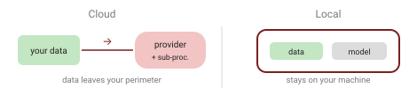

Reach for ChatGPT or Claude, or run a model on your own hardware? For most tasks the cloud is the obvious default. But the moment you're handling client or regulated data — especially in Europe — the question stops being about capability and becomes about **where your data goes**.

I've gone back and forth on this more than once, so this is where my thinking has landed for now, not a verdict I'd carve in stone.

## The trade-off, on four axes

| | Cloud (ChatGPT, Claude) | Self-hosted / local (Llama, Mistral, …) |
| --- | --- | --- |
| **Capability** | Frontier — best at the hardest reasoning, long context, tools | Strong and closing the gap; still behind at the very top |
| **Cost** | No hardware; pay per token — pricey at high volume | Big upfront hardware; near-zero per token after |
| **Ops** | Essentially none — provider runs it | You own GPUs/RAM, serving, updates, monitoring |
| **Privacy** | Data leaves you; a third party (and its sub-processors) processes it | Data never leaves your machine — the strongest control story |

## The cloud's hidden cost: your data leaves

With a cloud API you're almost always the **controller** and the provider a **processor** — so you need a **DPA** (GDPR Art. 28), and if the provider is US-based you're into **international transfers** (Chapter V). Post-*Schrems II*, Standard Contractual Clauses alone are shaky for US transfers; the EU–US Data Privacy Framework restores a mechanism but is under legal challenge. Add a chain of sub-processors, and every link is another exposure point. (See my [GDPR-when-coding-with-AI](/articles/data-privacy-gdpr-in-ai/) piece for the details.)

Local sidesteps all of that: no external processor, no transfer, no sub-processor chain. A clean privacy story **by design**.

## Local just got real

For years "run it locally" meant accepting a big quality drop. I'd tried it a few times and quietly gone back to the cloud each time. In 2026 that changed: open-weight models now deliver quasi-frontier quality on a workstation. A good concrete example is **DwarfStar (DS4)** by Salvatore Sanfilippo (antirez, the creator of Redis) — a small native inference engine that runs models like DeepSeek V4 Flash locally on Apple Silicon / CUDA / ROCm, using aggressive 2/8-bit quantization to fit a quasi-frontier model in roughly 96–128 GB of RAM. ([DS4 repo](https://github.com/antirez/ds4), [antirez — a few words on DS4](https://antirez.com/news/165))

His framing is the interesting part: it's *"the first time … I find myself using a local model for serious stuff that I would normally ask to Claude / GPT,"* and — the deeper point — *"AI is too critical to be just a provided service."* Data sovereignty as a principle, not just a compliance checkbox.

That line is the one I keep chewing on. Is it a genuine shift, or is it easy to say when you've got 128 GB of RAM to spare? A bit of both, probably — but the fact that a "serious stuff" local model is even on the table is new, and it moves the question from *can* you self-host to *should* you.

## When each actually wins

**Go local when:**

- the data is sensitive or regulated and must not leave your perimeter;
- you want *no* third-party processor at all;
- you need offline / air-gapped operation;
- volume is high and steady, so per-token cloud cost dominates;
- autonomy matters — you don't want your core tooling to be someone else's service.

**Stay in the cloud when:**

- you need maximum frontier capability;
- you want minimal ops and no hardware to buy and babysit;
- usage is low or spiky (idle GPUs are wasted money);
- you value always having the latest model over data locality.

## Two honest caveats

- **Local isn't automatically GDPR-compliant.** Self-hosting removes the *transfer* and *processor* problems — not governance. You're still the controller: access control, retention, a lawful basis and security are all still on you. Anyone who can reach the box can reach the data unless you lock it down.
- **There's still a capability gap** at the very top. The privacy win can cost you some quality; be honest about that trade for the task at hand. How big the gap is, and for how much longer, I genuinely can't call — it's been closing faster than I expected, and I've been wrong about the pace before.

## Takeaway

The default reflex — open a cloud chat and paste — is fine for throwaway work. But for anything with real personal or client data, "run it on our own machine" has gone from a purist's stance to a genuinely practical, and cleaner, option. Pick per task: frontier capability from the cloud when you need it, your own hardware when the data shouldn't leave.

Given how fast this is moving, though, the honest ending is: this is where I'd draw the line today. The hardware, the models and the legal ground under international transfers are all shifting — ask me again in a year and the balance may well have tipped.

## Sources

- [antirez — A few words on DS4](https://antirez.com/news/165) · [DwarfStar (DS4) repo](https://github.com/antirez/ds4) · [Distributing LLM inference in DwarfStar](https://antirez.com/news/167)
- GDPR framing: Art. 28 (processor/DPA), Chapter V (transfers), *Schrems II* (CJEU C-311/18), and the EU–US Data Privacy Framework — see my [GDPR article](/articles/data-privacy-gdpr-in-ai/).

*Local-model details reflect fast-moving 2026 developments (DS4, DeepSeek V4 Flash) — verify current specifics before relying on them. Not legal advice.*
