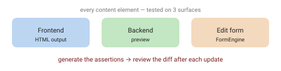

Content elements break quietly. A TYPO3 update, a moved class, an escaping change, a data processor that touches another one — and suddenly a variation renders wrong. Nobody in QA can click through every element, every toggle, every language and eyeball each reload. So we don't; and things slip.

Two T3DD26 talks fixed that for me — one on **testing content elements**, one on **seeding versioned data**. Together they're a practical QA setup.



## Test three surfaces, not one

A content element lives in three places, and all three can break:

- **Frontend rendering** — the HTML (or JSON/PHP output).
- **Backend preview** — how it looks in the page module.
- **Backend edit form** — the FormEngine editing view.

Plus the sneaky side effects: a shared partial or component reused across elements, an outdated preview, a relation to another element.

## The trick: generate the assertions

The approach (Daniel Gohlke & Daniel Siepmann) uses **only the plain TYPO3 testing framework** — functional tests against a fixture database — and one clever move: **you don't hand-write the expected HTML, you generate it.**

- One test file per element; each variation is an entry, defined in the file system. A data provider walks the tree and auto-discovers cases — adding a variation needs **no PHP**.
- Data sets are plain **PHP** (not CSV): a base record plus per-variation overrides merged in.
- It runs in a **single PHP process** (no real HTTP request), with output stripped to the element's body and volatile strings normalised, so assertions are stable.
- Then:

```bash
./vendor/bin/phpunit --filter textbox_color
ASSERTION_UPDATE=1 ./vendor/bin/phpunit --filter textbox_color
```

`ASSERTION_UPDATE=1` writes the current HTML back as the assertion. Everything goes green — and now **you review the generated HTML as a human**, in a git diff. After an upgrade, a failing test hands you a diff to scroll ("same, same — oh, *that* changed") instead of a day of clicking. Even integrators who don't write PHP can tweak Fluid, regenerate, and let review catch the impact.

The obvious risk: if you regenerate and rubber-stamp the diff without reading it, you've automated your way into a very green, very wrong test suite. The whole thing leans on someone actually reading the diff. I'd want to see how that holds up on a Friday afternoon.

Full-HTML compare (not `contains`) is deliberate: markup genuinely changes — a v14.3 patch already shifted some — so you want the diff, not a fragile substring check.

## Feed it versioned data: km2/data-seeder

Tests need reproducible content, and so does every developer on the team. Sharing a DB or `ddev pull` gives you drift and no history. The **`km2/data-seeder`** extension seeds TYPO3 records and files from **versioned YAML** — one git-tracked source of truth for dev *and* e2e (Tim Schreiner & Thomas Löffler):

```bash
ddev database:seed --reset
```

Same content for everyone, in git, and the same fixtures your tests build on.

## Why it pays

A real legacy project went v10 → v13 growing to ~1,700–2,000 functional tests — and each upgrade took **about half the time of the previous one**, done part-time by one person, because the tests caught the side effects. The philosophy: **the existing system is the requirement** (no client writes the whole thing down), and tests plus PHPStan are the base that lets you refactor with confidence.

What I still don't know: where's the break-even? A two-page brochure site won't earn 2,000 tests. Somewhere between that and a legacy monster there's a line, and I don't think I could draw it yet — I'd want to try this on a mid-size project first before I claim it always pays off.

This is the QA pillar in practice — the [objective function your tooling (and your AI) optimises against](/articles/foundations-of-ai-assisted-software-development/).

## Sources

- Daniel Gohlke & Daniel Siepmann — *Automated Testing for Content Elements* (T3DD26)
- [`km2/data-seeder`](https://github.com/km2gmbh/data-seeder) · [docs](https://docs.typo3.org/p/km2/data-seeder/main/en-us/) — Tim Schreiner & Thomas Löffler

*Notes from TYPO3 Developer Days 2026.*
