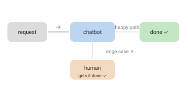

A weird little lesson in AI–human collaboration.

I tried to cancel an order shipped to a shop for pickup. The chatbot, after a generous helping of blah blah blah, informed me it simply couldn't. Instead I'd have to wait for the package to be delivered, let it sit in the shop for 14 days, and only then would it be automatically deleted and refunded.

Fine. A pointless waste, but fine.

Except — not fine. So I emailed support and asked a human to just delete the order. No way. The system does not allow that. The system, apparently, is a higher power.

So I resigned myself to waiting.

Then — one day after delivery — I got an email from an actual human being. He'd even tried to call me (I never answer unknown numbers). I hadn't picked up my package, so I could either send someone to collect it or get a refund. I took the refund. Money back, done.

Not a single one of the earlier chatbots or emails was ever read or acknowledged. But a human — a real, actual human — got it done in the end.

## The point

Development is full of edge cases. In the era of AI chatbots, it's edge cases all the way down.

Automation is great at the ninety percent it was designed for. The trouble is that customers keep showing up in the other ten — and a bot trained on the happy path will confidently, politely, refuse to help. What rescued my refund wasn't a smarter model. It was a person with the authority and the judgement to step outside the script.

But is that the model getting worse, or the process around it? I'm honestly not sure. A better bot might have flagged my case for a human on day one instead of day fifteen — the failure here was as much "no escape hatch" as "not smart enough". Maybe the right question isn't how good the bot is, but how fast it gives up gracefully.

That's the part worth keeping as we wire more AI into our products: not "can the bot handle most cases?" but "**what happens at the edge, and can a human still reach in?**" The human in the loop isn't a fallback you bolt on when the demo's done. On the edges, it's the whole product.

That's my current best guess, anyway — formed by one refund and a shop I'll be avoiding. Small sample size. But the pattern feels right.
