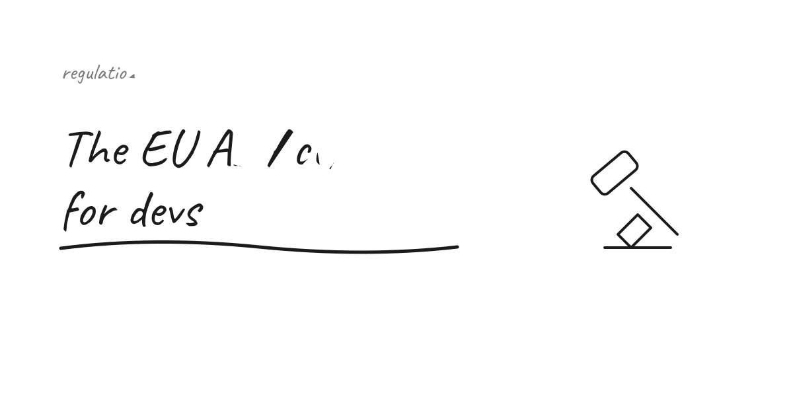
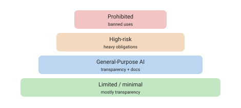

You've probably heard there's an EU AI Act. What's easy to miss is that it can apply to **you** — even from outside the EU — the same way GDPR does.

## It reaches beyond the EU

The AI Act applies to any **provider, deployer or importer** that puts an AI system on the EU/EEA market, or whose system is used within the EU — **regardless of where they're located**. So a Swiss startup, SaaS vendor, data processor or cloud provider serving EU customers is in scope if its system falls under the regulated categories. Non-compliance can mean **market bans or large fines** (enforced against your EU-facing entity).

If that pattern feels familiar, it should: it's the same extraterritorial logic as GDPR.

## What it actually regulates

The Act is **risk-tiered**, not one-size-fits-all:

- **Prohibited practices** — a small set of banned uses (e.g. social scoring).
- **High-risk systems** — the heavy tier: risk management, data governance, documentation, human oversight, transparency, logging. This is where most obligations live.
- **General-Purpose AI (GPAI)** — foundation-model providers face transparency and documentation duties (and more for the largest models).
- **Limited/minimal risk** — mostly transparency (e.g. tell users they're talking to AI).

Obligations **phase in on a staggered timeline** — prohibitions first, then GPAI transparency/documentation, then the full high-risk regime — rolling out across 2025–2027. (Check the current dates for your category against the official text before you plan around them; the schedule is specific and has moved.)

## What a dev team should do

- **Classify your systems.** Most everyday software is minimal/limited risk — but know if anything you build or *deploy* lands in high-risk or GPAI territory. Where exactly the line sits for borderline cases is the part I find genuinely hard, and I don't think I'd trust my own gut on it — that's a question for a lawyer, not a blog post.
- **If you only deploy** third-party AI, you still have deployer duties (human oversight, using it as intended, transparency).
- **Documentation is the theme** — like GDPR, "we thought about it and wrote it down" is much of the job. Nobody ever loved writing it. It's still much of the job.
- **It stacks with GDPR**, it doesn't replace it. Personal data still means [GDPR duties](/articles/data-privacy-gdpr-in-ai/) on top.
- **Swiss teams: you're not exempt** if you target the EU. Plan as if you are in scope.

## Takeaway

The AI Act isn't only a problem for big model labs. If your software uses or offers AI and reaches EU users, work out which tier you're in now — the expensive surprise is discovering you're "high-risk" late.

The open question I keep coming back to: how much of this will feel like GDPR did — a scramble, then a settled routine — versus something that keeps shifting under us as the dates and definitions move? I don't know yet. For now I'm treating "figure out your tier early" as the one safe bet.

## Sources

- [EU — Artificial Intelligence Act (official)](https://artificialintelligenceact.eu/) and the [European Commission AI Act page](https://digital-strategy.ec.europa.eu/en/policies/regulatory-framework-ai)

*Informational, not legal advice. The phase-in dates and category definitions are detailed and evolving — verify against the official text for your specific case.*
