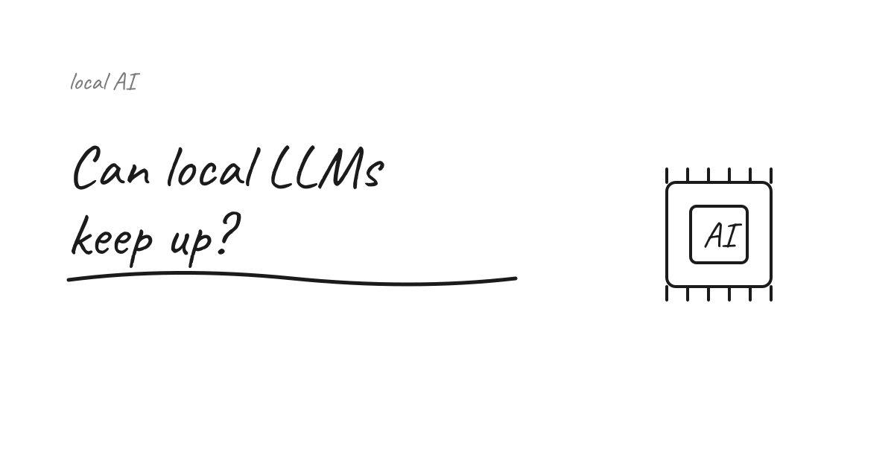
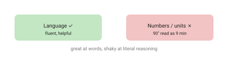

I keep testing local models against real work — not benchmarks, actual tasks. Here's what I've found, the good and the awkward. It's the practical side of the [cloud-vs-self-hosted question](/articles/cloud-vs-self-hosted-ai/).

## The hardware question is now just a budget question

If I could justify a Mac Studio M3 with 256 GB — better, 512 GB — of unified memory, I could run something like DeepSeek V4 Pro **completely locally**. A few years ago that would have sounded unrealistic; today it's mostly a hardware-budget question. (The wallet remains the hardest constraint in computing.) And that changes the whole conversation around privacy, cost, latency and digital sovereignty: frontier-ish capability on your own machine.

Would I actually buy it? That's the part I keep going back and forth on. The capability is real, but "I could run it locally" and "I should" aren't the same question, and I haven't settled it.

## Code review: local vs cloud

I ran the **same code review** two ways: local **opencode + Gemma-4**, and **Claude Code (Opus 4.8)**. The results were clearly different — and confirmed my impression that Claude Code is still the better tool. Gemma-4 missed some bugs completely.

So for the hardest, highest-stakes work, real **independence is still some way off**. Local is close enough for a lot of things; it isn't yet a drop-in replacement where catching the subtle bug matters.

Though I'll admit one test isn't a benchmark. Was it the model, the tooling, or my prompt? Probably some of each. I'd want to run this properly across more reviews before I trust the conclusion too far — for now it's an impression, not a verdict.

## The gym test: LLMs are great at language, not at lifting

For fun I've been throwing my training routine at various models. Almost all of them struggle: even when the plan is written clearly, they **confuse the numbers** constantly. It's a neat reminder that LLMs are superb at *language* and weak at precise, literal reasoning.

The best example: Gemma-4 (running free and fully on-device via Edge Gallery — genuinely awesome that this works on a phone) does not accept that **`90"` means 90 seconds**. I told it three times, with examples. It kept telling me to rest **nine minutes** between sets. So today's session ran a little long.

## Takeaway

Local models have crossed from "toy" to "useful" — great for privacy, cost and sovereignty, and impressive on a laptop or even a phone. But be honest about the gap: for demanding code review, the frontier cloud model still wins, and for anything that hinges on exact numbers, *check its work*. Pick the tool per task — and don't let it plan your rest times.

How long does the gap last? I genuinely don't know. The numbers-and-units weakness feels more fundamental than the code-review one, but I've been wrong about "fundamental" limits before. Ask me again after the next model drop.

## Sources

- [antirez — DwarfStar (DS4), running local inference](https://antirez.com/news/165)
- See also my [cloud vs self-hosted AI](/articles/cloud-vs-self-hosted-ai/) piece.

*Reflects fast-moving 2026 tooling (DeepSeek V4, Gemma-4, opencode) — specifics change quickly.*
