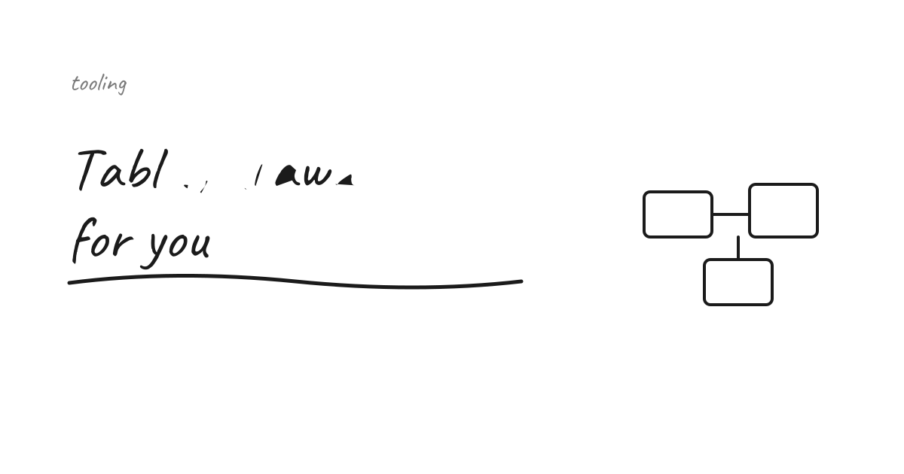
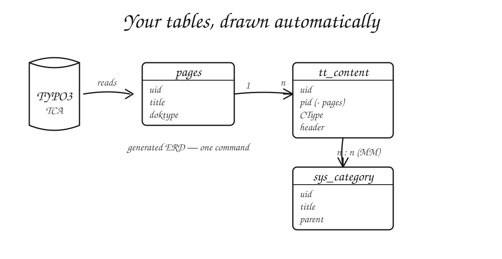

You know what sucks? Manually creating ER diagrams — especially when you have to jump into an unknown project or extension and reverse-engineer how everything fits together.

So I built something for it. I'm releasing the **ERD extension**: it lets developers generate entity-relationship diagrams **directly from their extension's structure** — no manual drawing, no drifting-out-of-date diagram in a wiki somewhere. (We all know the one: last edited three years and two data models ago.)

## Why

- **Onboarding.** Land in an unfamiliar extension and *see* the data model in minutes instead of tracing TCA and relations by hand.
- **Always current.** The diagram comes from the actual structure, so it reflects reality — not a picture someone drew once and never updated.
- **Documentation, cheaply.** A living ERD is one of the highest-value, lowest-effort pieces of docs a TYPO3 project can have.

What I'm still turning over: how much of the relationship graph can you honestly read straight from TCA, and where does it stop being reliable? Inline records and MM tables are clear enough; the messier, hand-rolled relations are where I'm less sure the generated picture tells the whole truth. That's the part I most want other people to stress-test.

## Try it

Give it a try — feedback very welcome: <https://lnkd.in/eupFuJYg>

> **Draft note (David to fill in before publishing):** the concrete details — the exact extension name, `composer require …`, how you run the generation, supported TYPO3 versions, and a screenshot of a generated diagram. I've left those out rather than guess them.

## Sources

- ERD extension — <https://lnkd.in/eupFuJYg>
