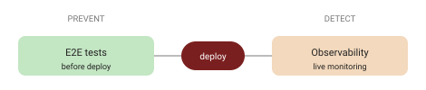

A website can break in two windows: **before** you deploy (a regression you didn't catch) and **after** (something that only shows up in production). Most teams cover one and hope for the other. You need both — and they're two different tools.

## E2E tests: prevent (proactive)

End-to-end tests verify that the critical things actually work *before* a deploy goes out.

- A **centralised E2E package** installed in each project, giving **standard tests** for common functionality plus room for **project-specific** ones.
- Runs **nightly or on-demand**, locally or on a preview environment; scripts simulate real user actions and check the results.
- Produces a **pass/fail report** that highlights broken pages, forms or plugins — visible to the team, and optionally to the client.

Two rules that keep it healthy: **define the valuable flows with the PL/client** (test what matters, not everything), and **don't let tests block the deploy** — they inform, they don't gate you into a corner.

## Observability: detect (reactive)

Observability watches the **live** site and tells you when something's wrong.

- Scope: PHP logs, TYPO3 **DevLogs**, HTTP errors, optionally JS errors.
- A **centralised logging system** (e.g. Grafana Alloy / Loki, and existing tools like Sentry), with **dashboards** for trends and **alerts** when thresholds are crossed.
- Value: catch production issues early, cut downtime and client impact, and see trends over time.

One trap: set **alert thresholds** carefully, or the noise trains everyone to ignore them.

## Two halves of one story

| | E2E tests (proactive) | Observability (reactive) |
| --- | --- | --- |
| **Goal** | Works *before* deploy | Watch the *live* site |
| **Output** | Verified pages/forms/plugins; test reports | Central logs, dashboards, alerts |
| **Benefit** | Fewer live errors, confident releases | Detect issues early, track trends, less downtime |
| **Effort** | Setup + occasional per-project tests; nightly/on-demand | Central setup + log forwarding; low ongoing |

Together they cover the whole line: **prevent** what you can, **detect** the rest.

## Observability isn't tools — it's an owner

This is the part teams skip. Buy the dashboards, wire the alerts, and without someone responsible you've just built a **noise machine** that dumps extra work on developers.

Observability needs an **owner** — someone who:

- decides which alerts are **critical vs informational**, and tunes thresholds to kill noise;
- **triages** each alert — fix now, schedule in the backlog, or just watch the trend;
- maintains the dashboards and reports trends;
- communicates impact and plans interventions with business and client.

A simple flow: alert fires → owner triages (**critical** → assigned & fixed ASAP · **medium** → backlog · **informational** → monitored) → status reported → thresholds refined. That's what turns monitoring into value instead of overhead.

## Where AI can help: triage

A natural next step (a hypothesis I'm exploring): feed the logs — Sentry runtime errors and stack traces, Grafana/Loki/Prometheus logs and metrics — to an AI layer that:

- **categorises** each issue (critical / medium / informational);
- **clusters and deduplicates** similar errors (same type, page, plugin) to cut noise;
- **suggests a probable root cause** from historical correlations (a misconfigured plugin, a missing template).

The human owner still decides — but starts from a triaged, de-duplicated list instead of a wall of raw alerts.

## Takeaway

E2E tests and observability are the two halves of production QA: prevent before deploy, detect after. Buy tools if you like — but the value comes from **defining what matters with the client**, keeping alerts quiet enough to trust, and giving observability a real **owner**. That's what earns the confidence, on your side and the client's, that a deployed site is actually fine.

## Sources

- [Grafana Alloy](https://grafana.com/docs/alloy/) · [Sentry](https://sentry.io/) — logging/observability tooling referenced above.

*Based on our website-framework testing & observability work.*
